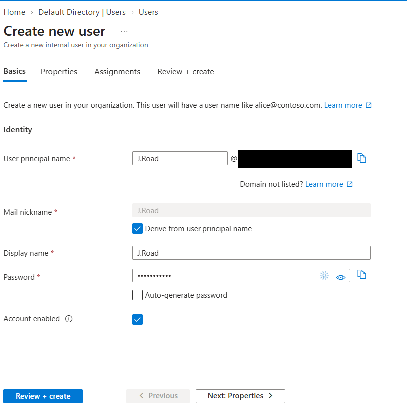
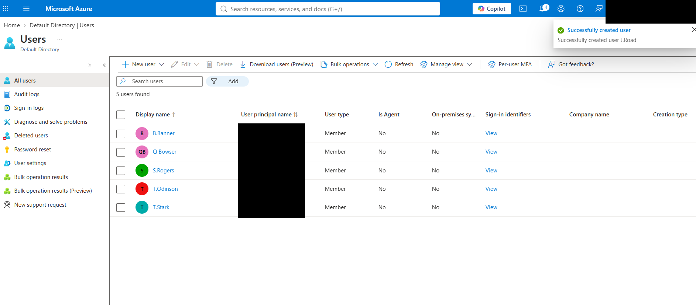
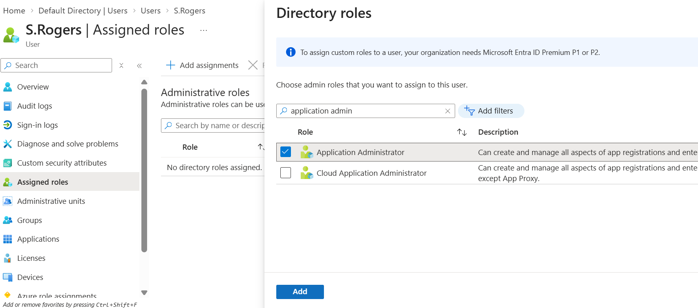
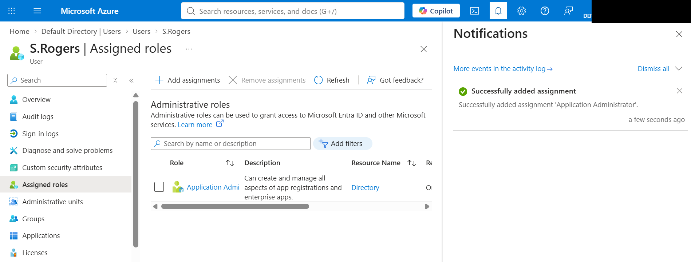
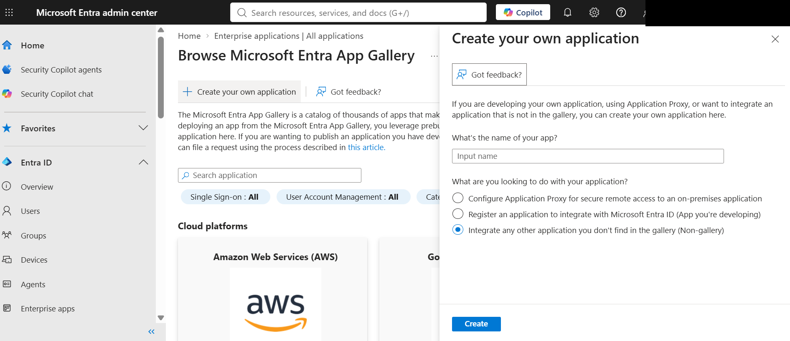
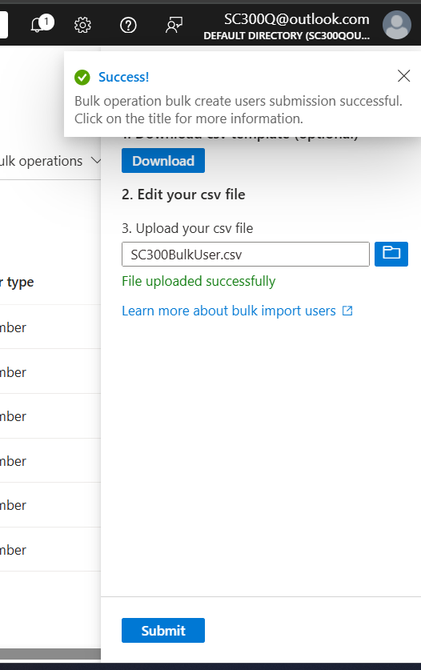
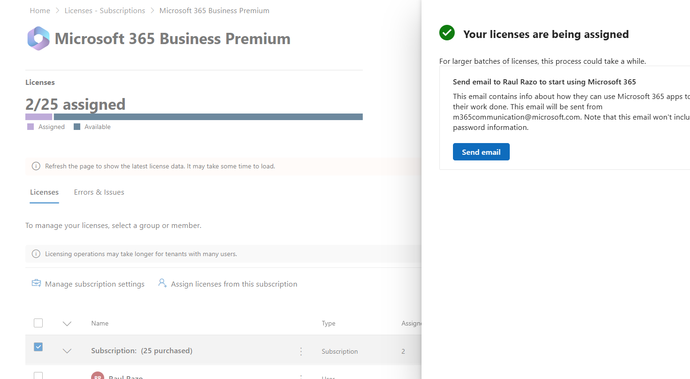
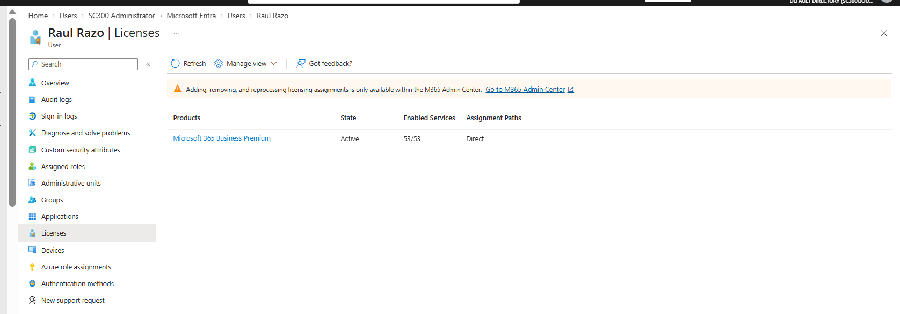

# Lab 01 – Manage User Roles

**Status:** Lab Completed

## Objective

Manage Microsoft Entra ID users, administrative roles, bulk user provisioning, and Microsoft 365 licensing while applying identity and access management principles.

## Tasks Completed

- Created and managed Microsoft Entra ID user accounts
- Assigned the Application Administrator directory role
- Verified administrative permissions
- Performed bulk user provisioning
- Practiced PowerShell-based user provisioning
- Assigned and verified Microsoft 365 licensing

## IAM Skills Demonstrated

- Identity lifecycle management
- Role-Based Access Control (RBAC)
- Least-privilege administration
- User provisioning
- Bulk identity administration
- Microsoft Graph / PowerShell administration
- License management

## Screenshots

### User Creation

Created a new Microsoft Entra ID user and configured the account identity settings.

Verified successful user provisioning and confirmed the new account appeared in the tenant.

### Administrative Role Assignment

Selected the Application Administrator role to grant delegated administrative access.

Verified the Application Administrator role was successfully assigned to the user.

### Permission Verification

Validated the assigned role by accessing application administration capabilities in Microsoft Entra ID.

### Bulk User Provisioning

Used CSV-based bulk provisioning to create multiple Microsoft Entra ID users efficiently.

### License Management

Assigned Microsoft 365 Business Premium licensing to provide the user with required services.

Verified the Microsoft 365 Business Premium license was active and directly assigned to the intended user.

## Key Takeaway

This lab demonstrated how Microsoft Entra ID administrators manage identities, apply least-privilege access through directory roles, scale user provisioning, and manage user licensing.
