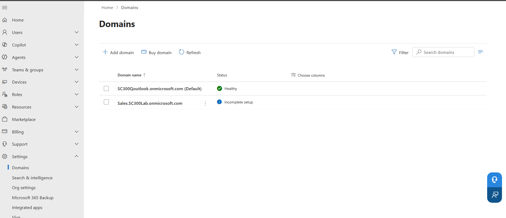
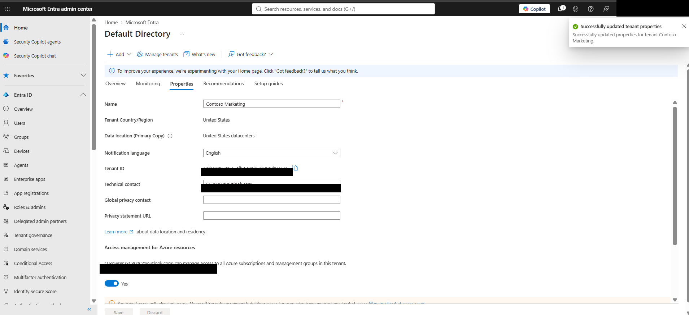
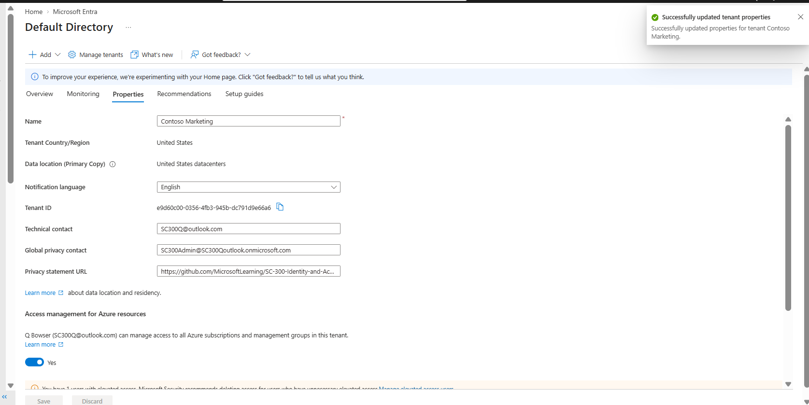
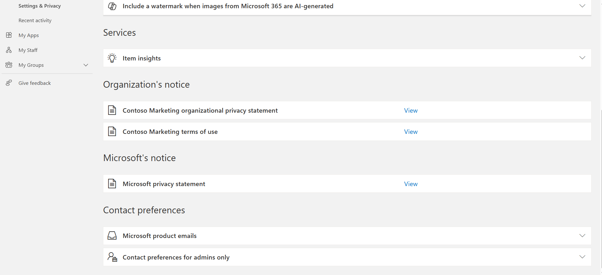

# SC-300 Lab 02: Working with Tenant Properties

## Overview

This lab focused on administering and reviewing Microsoft Entra tenant-level properties. I configured a custom tenant subdomain, updated organizational tenant properties, reviewed tenant identification and location information, configured privacy information, and verified that the organizational privacy statement was available to users.

**Microsoft Learn Module:** Module 01 – Implement an Identity Management Solution  
**Lab:** 02 – Working with Tenant Properties  
**Platform:** Microsoft Entra ID / Microsoft 365 Admin Center  
**Certification:** Microsoft Certified: Identity and Access Administrator Associate (SC-300)

---

## Objectives

During this lab, I performed the following administrative tasks:

- Created a custom `.onmicrosoft.com` subdomain.
- Navigated between Microsoft Entra ID and the Microsoft 365 Admin Center for tenant administration.
- Updated the Microsoft Entra tenant display name.
- Configured the tenant technical contact.
- Reviewed the tenant's country/region and data location.
- Located the unique Microsoft Entra Tenant ID.
- Configured a Global Privacy Contact.
- Configured an organizational Privacy Statement URL.
- Verified that the organizational privacy statement was available through the user's Microsoft My Account portal.

---

## Exercise 1 – Create a Custom Subdomain

I began by navigating to:

**Microsoft Entra ID → Domain names → Add custom domain**

I entered the following custom subdomain:

`Sales.SC300Lab.onmicrosoft.com`

Because `.onmicrosoft.com` domain management is restricted within the Microsoft Entra admin center, Microsoft redirected the configuration process to the **Microsoft 365 Admin Center**.

From the Microsoft 365 Admin Center, I navigated to:

**Settings → Domains**

I then initiated the addition of the new subdomain.

The lab did not require DNS configuration, so DNS verification was intentionally not completed. The resulting **Incomplete setup** status was expected for this exercise.

### Screenshot 1 – Create Custom Tenant Subdomain

**Result:** Successfully initiated the custom `Sales.SC300Lab.onmicrosoft.com` subdomain configuration through the Microsoft 365 Admin Center. DNS configuration was intentionally omitted according to the lab requirements.

---

## Exercise 2 – Configure Tenant Properties

Next, I returned to the **Microsoft Entra admin center** and navigated to:

**Entra ID → Overview → Properties**

I modified the tenant's organizational information.

### Tenant Display Name

The tenant display name was changed to:

`Contoso Marketing`

### Technical Contact

I configured the tenant's technical contact using the administrator account associated with the lab environment.

After saving the configuration, Microsoft Entra displayed a **Successfully updated tenant properties** notification, confirming that the changes were applied.

### Review Tenant Information

While reviewing the tenant properties, I identified several important tenant-level attributes:

- **Tenant Country/Region:** United States
- **Data Location:** United States datacenters
- **Tenant ID:** Unique identifier assigned to the Microsoft Entra tenant

I also learned that the tenant's **Country/Region is established when the tenant is created and cannot be changed afterward**.

The Tenant ID uniquely identifies a Microsoft Entra directory and can be used when configuring Azure resources, applications, authentication, automation, and identity integrations.

### Screenshot 2 – Update Microsoft Entra Tenant Properties

**Result:** Successfully updated the tenant display name and technical contact while reviewing the tenant's geographic and identification properties.

> **Security Note:** Tenant-specific identifiers should be redacted from public portfolio screenshots when they are not necessary to demonstrate the skill.

---

## Exercise 3 – Configure Tenant Privacy Information

The final exercise focused on configuring organizational privacy information.

From the Microsoft Entra **Properties** page, I configured:

- **Global Privacy Contact**
- **Privacy Statement URL**

Because the Microsoft Learn lab's predefined user was not present in my lab tenant, I used an existing administrative account within my SC-300 environment as the Global Privacy Contact.

After saving the settings, Microsoft Entra confirmed that the tenant properties were successfully updated.

### Screenshot 3 – Configure Tenant Privacy Information

**Result:** Successfully configured a Global Privacy Contact and organizational Privacy Statement URL at the tenant level.

---

## Verify the Organizational Privacy Statement

After configuring the privacy settings, I verified the configuration from the user's perspective.

I signed into the Microsoft **My Account** portal using the organizational SC-300 administrator account and navigated to:

**My Account → Settings & Privacy → Privacy**

Under **Organization's notice**, the following entry was available:

**Contoso Marketing organizational privacy statement**

The **View** option was available, demonstrating that the tenant-level privacy configuration was successfully presented to users.

### Screenshot 4 – Verify Organizational Privacy Statement

**Result:** Successfully verified that users within the Microsoft Entra tenant could access the organization's configured privacy statement.

---

## Skills Demonstrated

- Microsoft Entra ID administration
- Microsoft 365 Admin Center
- Tenant administration
- Tenant properties
- Custom domain and subdomain configuration
- Organizational identity configuration
- Tenant identification
- Privacy and governance settings
- Administrative contacts
- Microsoft Entra user-facing privacy notices
- Identity and Access Management (IAM)
- Microsoft cloud administration

---

## Key Takeaways

This lab demonstrated that Microsoft Entra tenant administration extends beyond user and group management. Tenant-level settings establish important organizational information used throughout Microsoft's cloud identity environment.

I gained hands-on experience navigating between the **Microsoft Entra admin center** and **Microsoft 365 Admin Center**, modifying tenant properties, identifying tenant-specific information, and configuring organizational privacy information.

I also learned the importance of configuration verification. After configuring the privacy statement at the tenant level, I verified the result through the user's **My Account** experience to confirm that the organizational notice was available to the user.

---

## Portfolio Evidence

| Screenshot | Evidence |
|---|---|
| `01-custom-subdomain.png` | Custom tenant subdomain configuration |
| `02-tenant-properties-updated.png` | Tenant name, technical contact, location, and tenant properties |
| `03-configure-tenant-privacy-information.png` | Global Privacy Contact and Privacy Statement configuration |
| `04-verify-organizational-privacy-statement.png` | End-user verification of organizational privacy notice |

---

## Lab Status

**Lab 02 – Working with Tenant Properties: COMPLETE ✅**

**SC-300 Portfolio Progress:** Lab 01 ✅ | Lab 02 ✅
