# Lab 03 – Group-Based Licensing and Dynamic Groups

## Overview

In this lab, I used Microsoft Entra ID and the Microsoft 365 Admin Center to configure group-based licensing and dynamic group membership. The lab demonstrates how identity administrators can automate access and license management through group membership and dynamic membership rules.

This lab was completed as part of my hands-on preparation for the Microsoft SC-300: Identity and Access Administrator certification.

---

## Objectives

- Create and manage a security group in Microsoft Entra ID
- Add a user to a security group
- Assign Microsoft 365 licensing through group membership
- Verify that a user inherited a license from the group
- Create and configure a dynamic membership group
- Build dynamic membership rules using user attributes
- Validate dynamic membership rules
- Compare Member and Guest user behavior
- Verify automatic membership changes after rule processing

---

## Technologies Used

- Microsoft Entra ID
- Microsoft Entra Admin Center
- Microsoft 365 Admin Center
- Microsoft 365 Business Premium
- Dynamic Groups
- Group-Based Licensing
- Microsoft Entra Dynamic Membership Rules

---

## Lab Environment

**Tenant:** Contoso Marketing  
**Security Group:** `sg-SC300-O365`  
**Dynamic Group:** `SC300-myDynamicGroup`

The environment contains standard Entra ID Member accounts as well as a Guest account, allowing dynamic membership rules to be tested against different user types.

---

## Part 1 – Create a Security Group

I created the security group:

`sg-SC300-O365`

The group was configured to support centralized access and license management.

A test user, **Omar Bennett**, was added to the group.


### Evidence – Security Group Creation

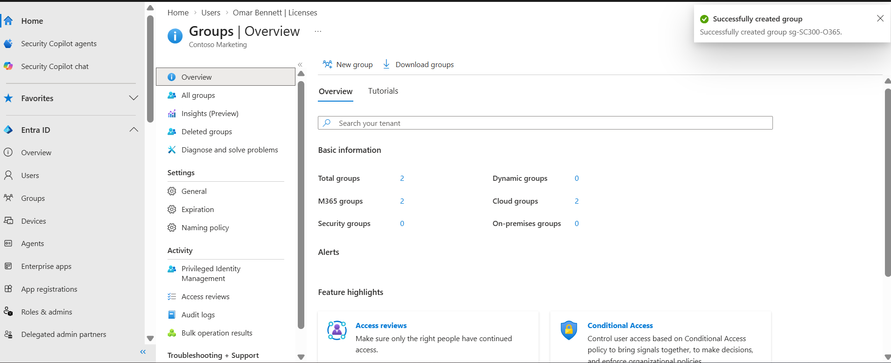

The security group `sg-SC300-O365` was successfully created in Microsoft Entra ID.

### Evidence – Group Membership

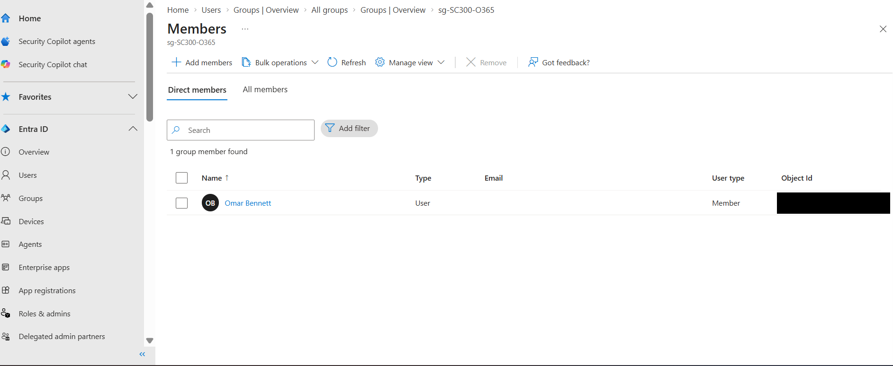

The test user was successfully added as a member of the security group.

---

## Part 2 – Configure Group-Based Licensing

Using the Microsoft 365 Admin Center, I assigned a Microsoft 365 Business Premium license to the `sg-SC300-O365` security group.

Instead of assigning the license directly to the individual user, licensing was inherited through group membership.

### Result

Omar Bennett received:

**Microsoft 365 Business Premium**

The Entra ID license page showed:

- State: **Active**
- Enabled Services: **53/53**
- Assignment Path: **Inherited (sg-SC300-O365)**

This demonstrates centralized license administration using group-based licensing.
### Evidence – Before Group Licensing

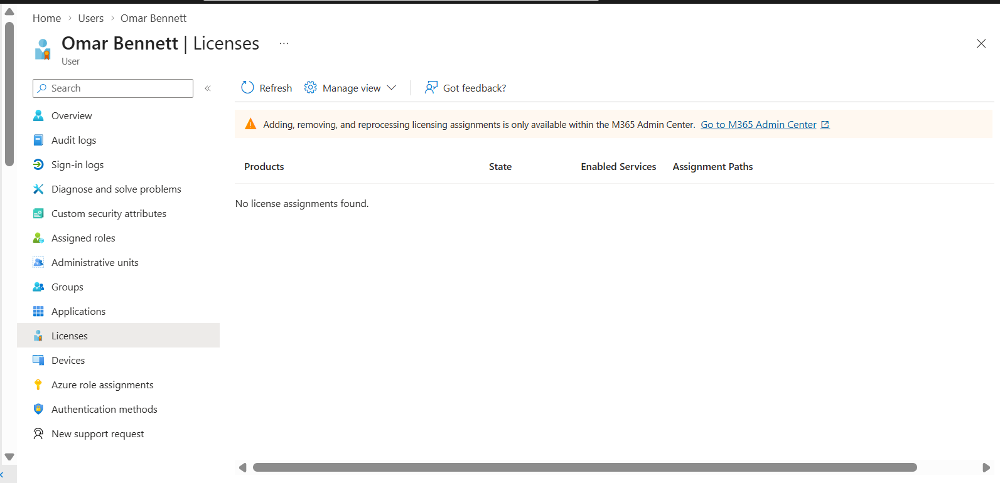

Before group-based licensing was configured, the test user had no license assigned.

### Evidence – Group-Based License Assignment

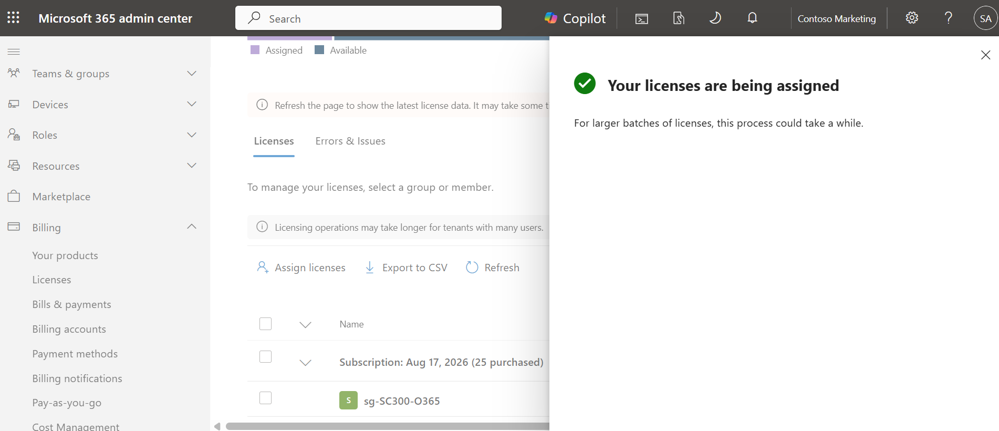

Microsoft 365 Business Premium licensing was assigned to the `sg-SC300-O365` security group through the Microsoft 365 Admin Center.

### Evidence – License Inheritance Validation

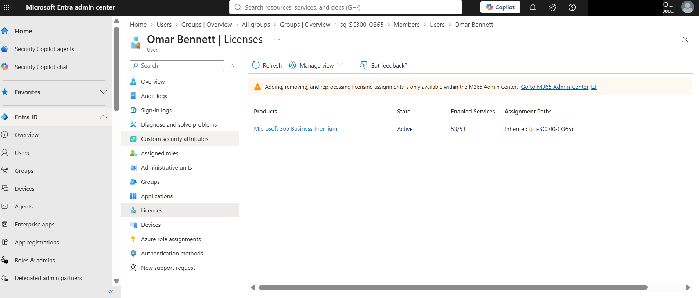

After the group license assignment was processed, the test user received Microsoft 365 Business Premium through the `sg-SC300-O365` group, validating group-based license inheritance.

### Evidence - Licensed Group Verification

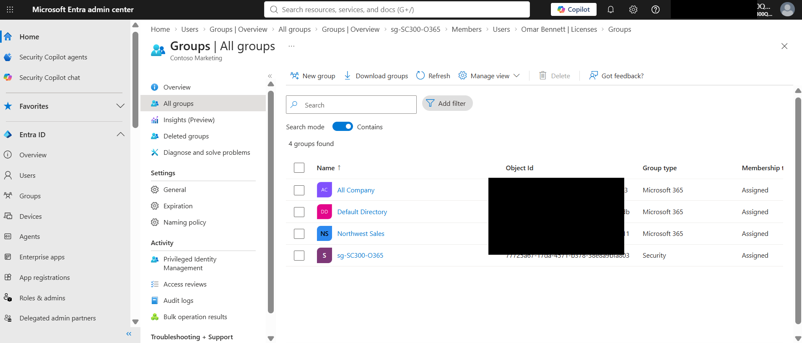

The Northwest Sales group was reviewed to verify the group configuration used during the licensing exercise.

---

## Part 3 – Create a Dynamic Membership Group

I created the dynamic group:

`SC300-myDynamicGroup`

Dynamic groups allow Microsoft Entra ID to automatically determine membership based on user attributes rather than requiring administrators to manually add and remove users.

An initial rule was used to evaluate directory users.

Example:

`user.objectId -ne null`

After processing completed, Entra ID automatically populated the group with matching users.
### Evidence – Dynamic Membership Rule

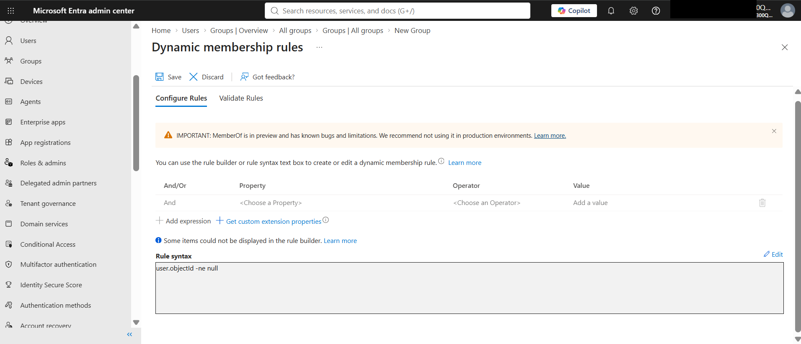

### Evidence – Dynamic Group Processing

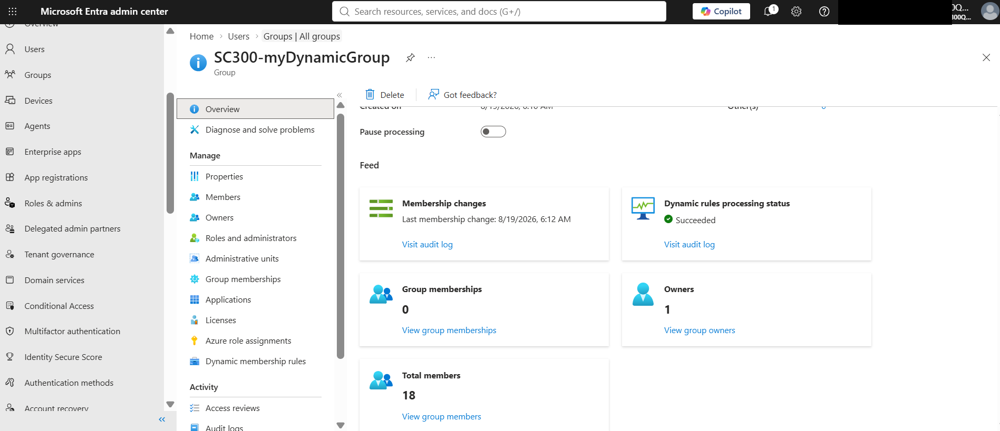

### Evidence – Dynamic Group Membership

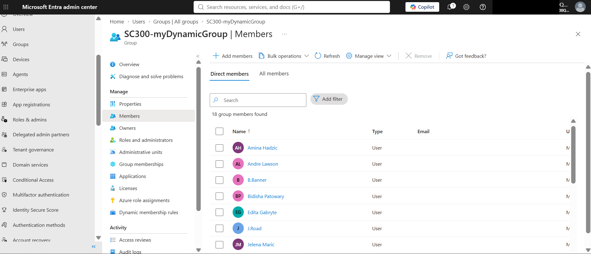
---
## Part 4 – Dynamic Rule for Guest Users

I modified the membership rule to identify Guest accounts.

```text
(user.objectId -ne null) and (user.userType -eq "Guest")
```
### Evidence – Guest User Dynamic Rule

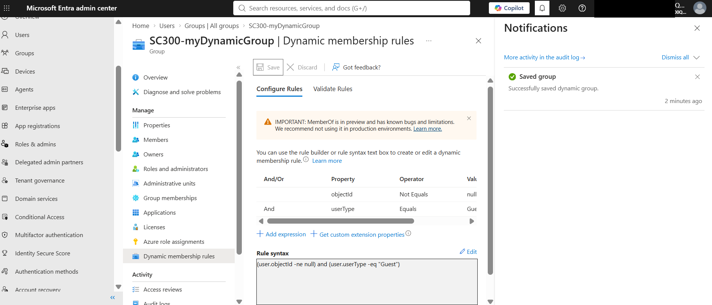

The dynamic membership rule was updated to identify Guest users in Microsoft Entra ID.

### Evidence – Guest Rule Validation

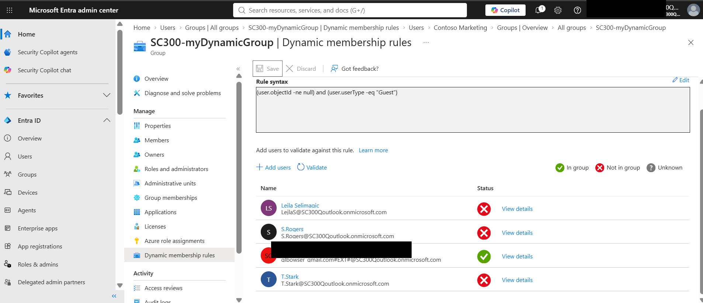

The rule validation confirmed that the Guest test account matched the rule while standard Member accounts did not.

### Result

After dynamic rule processing completed, the group contained the Guest account:

**SC300 Guest Test**

This demonstrated attribute-based automatic group membership.

### Evidence – Guest Dynamic Group Membership

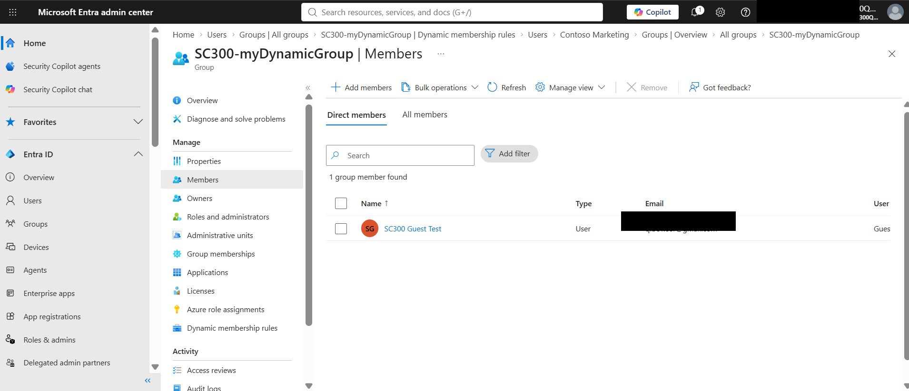

The Guest test account was automatically added to the dynamic group after the membership rule was processed.
---

## Part 5 – Dynamic Rule for Member Users

I also tested the inverse scenario by changing the rule to:

```text
(user.objectId -ne null) and (user.userType -eq "Member")
```

Rule validation showed that standard directory Member accounts matched the rule while the Guest account did not.

### Evidence – Member Dynamic Rule Processing

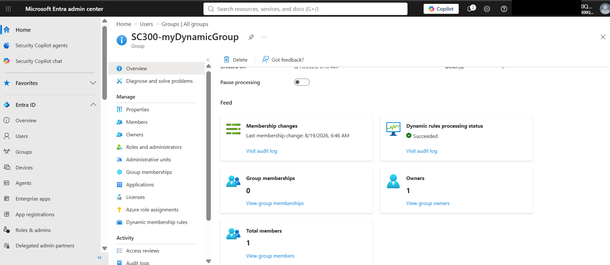

The dynamic membership rule was processed after changing the `userType` condition from Guest to Member.

### Evidence – Member Rule Validation

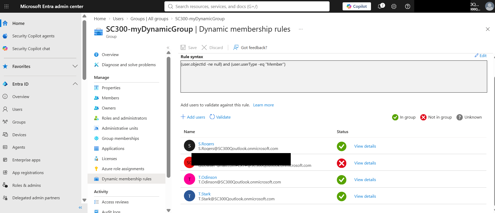

Rule validation confirmed that standard directory Member accounts matched the rule while the Guest account did not.

This demonstrates how Microsoft Entra ID dynamic membership rules can automatically separate internal Member accounts from external Guest identities based on the `userType` attribute.

### Evidence - Final Dynamic Group Processing

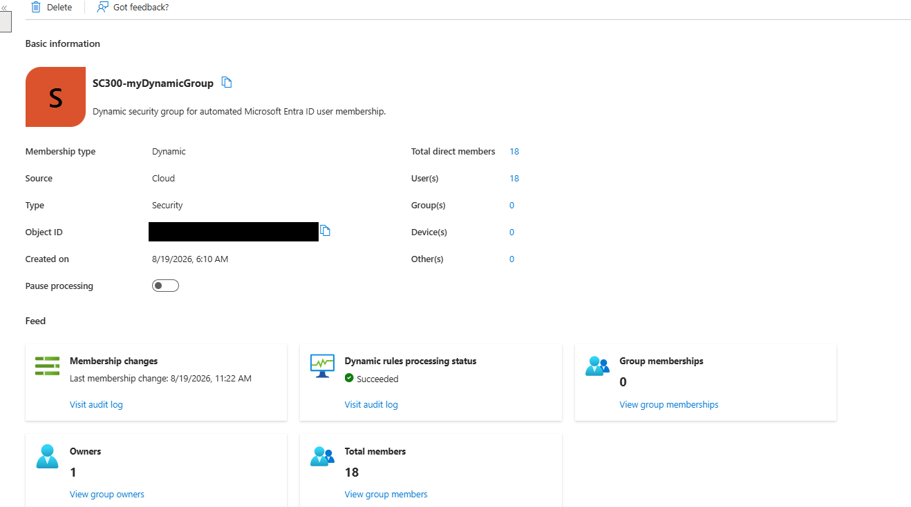

Microsoft Entra ID successfully processed the updated dynamic membership rule. The processing status showed **Succeeded**, and the group membership was automatically updated to include the directory users that matched the Member-based rule.

This provided final validation that Microsoft Entra ID can dynamically maintain group membership based on the `userType` attribute without manually adding users.

---

## Key Skills Demonstrated

- Microsoft Entra ID administration
- Identity lifecycle management
- Security group administration
- Group-based licensing
- Microsoft 365 license management
- Dynamic group configuration
- Dynamic membership rule syntax
- User attribute evaluation
- Member vs. Guest identity management
- Rule validation and troubleshooting
- Automated identity administration

---

## Security / IAM Relevance

Dynamic groups and group-based licensing reduce repetitive administrative work and help organizations apply access consistently at scale.

Rather than manually assigning resources to every user, administrators can use identity attributes and group membership to automate access and entitlement decisions.

This supports IAM concepts including:

- Automated provisioning
- Identity lifecycle management
- Attribute-based identity administration
- Least-privilege access management
- Standardized entitlement assignment

---

## What I Learned

This lab provided hands-on experience using Microsoft Entra ID to automate identity administration.

I learned how group membership can control Microsoft 365 license assignment and how dynamic membership rules can automatically include or exclude users based on identity attributes such as `userType`.

I also practiced validating dynamic rules before relying on them for automated membership changes.

---
## Lab Evidence Summary

The following activities were successfully configured and validated during this lab:

1. Security group creation
2. User membership in `sg-SC300-O365`
3. Microsoft 365 group license assignment
4. User license inherited through group membership
5. Dynamic membership rule configuration
6. Dynamic group processing
7. Guest user dynamic rule validation
8. Guest dynamic group membership
9. Member-user rule validation
10. Final Member dynamic group processing and membership update

---

## SC-300 Skills Alignment

This lab supports SC-300 identity administration skills involving:

- Managing Microsoft Entra identities
- Managing groups
- Managing licenses
- Configuring dynamic membership
- Managing external identities
- Automating identity and access administration

---

## Status

**Lab Completed – Hands-On Configuration and Validation Performed**
