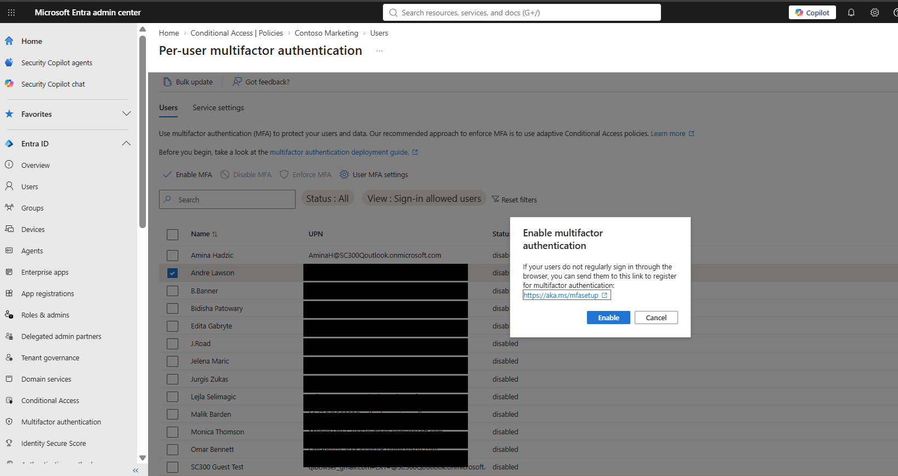
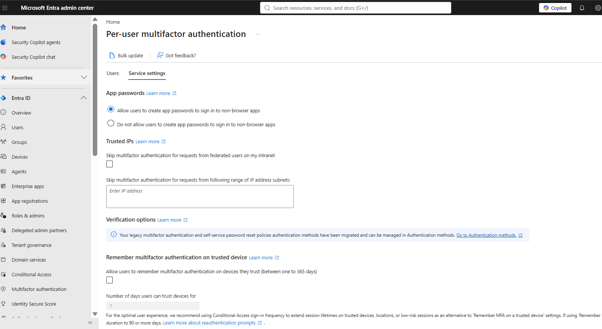
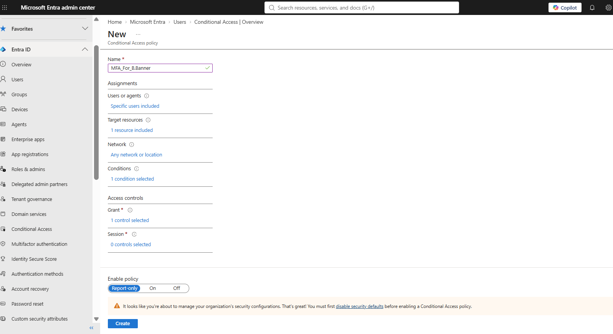
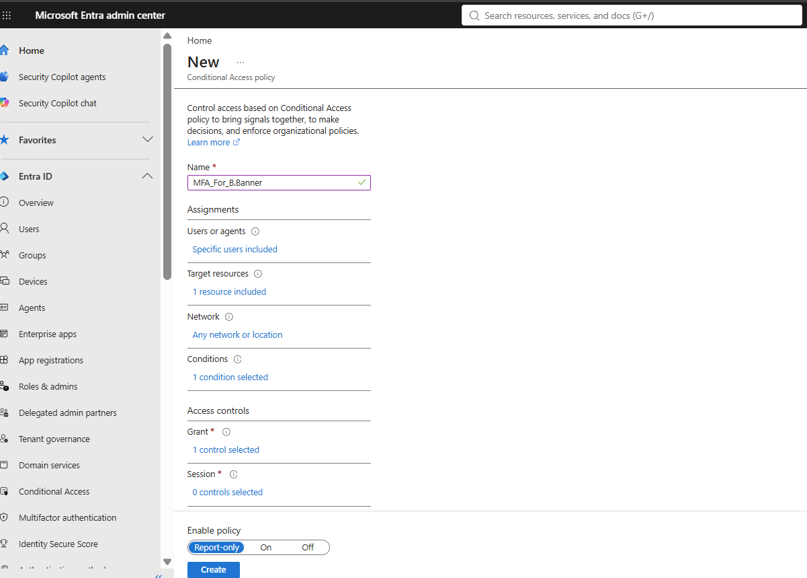
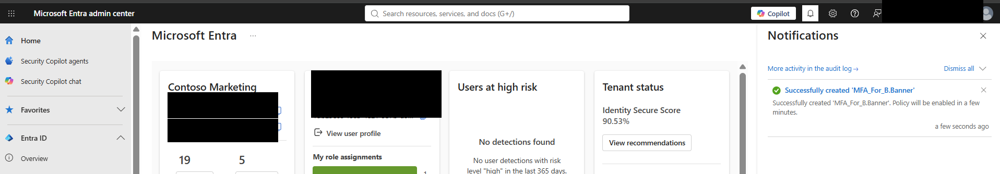
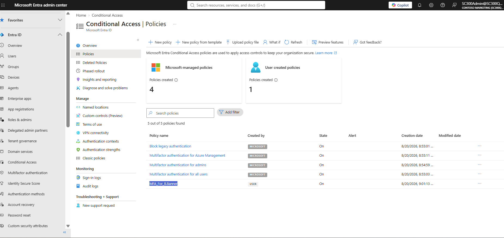
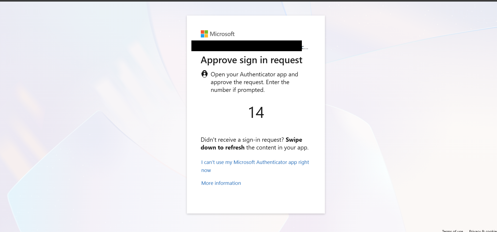
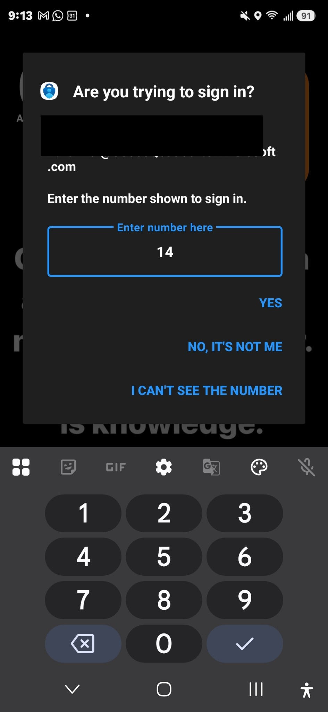
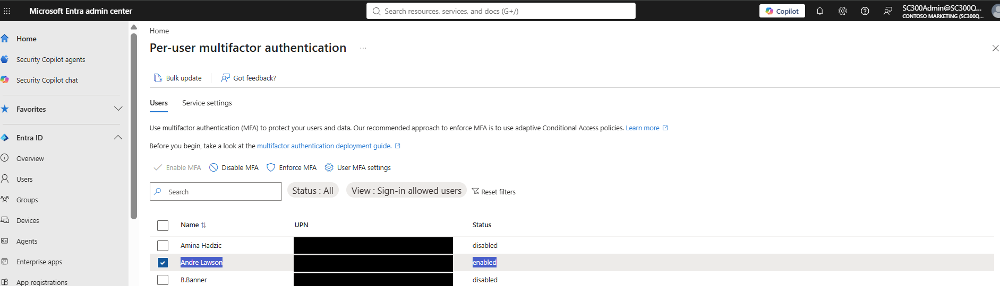

# Lab 08 – Implement Multi-Factor Authentication (MFA)

## Overview

In this lab, I configured and tested Multi-Factor Authentication (MFA) in Microsoft Entra ID. I worked with both legacy per-user MFA settings and modern Conditional Access policies to understand how organizations can strengthen identity security and protect user sign-ins.

The lab included enabling MFA for individual users, reviewing MFA service settings, creating a Conditional Access policy requiring MFA, and validating the authentication experience using Microsoft Authenticator number matching.

---

## Objectives

- Configure per-user Multi-Factor Authentication in Microsoft Entra ID
- Review MFA service settings and trusted-device options
- Configure a Conditional Access policy requiring MFA
- Target specific users with an MFA policy
- Validate MFA enforcement during user sign-in
- Test Microsoft Authenticator number matching
- Compare legacy per-user MFA with Conditional Access-based MFA

---

## Environment

- Microsoft Entra ID
- Microsoft Entra admin center
- Microsoft Entra Conditional Access
- Microsoft Authenticator
- Test user accounts
- Microsoft 365 / Entra test tenant

---

# Lab Walkthrough

## 1. Enable Per-User MFA

I accessed the **Per-user multifactor authentication** management interface in Microsoft Entra ID and selected a test user for MFA configuration.

This provided hands-on experience with the legacy per-user MFA management method.

*Figure 1: Confirmation prompt displayed while enabling per-user MFA for the selected test account.*

---

## 2. Review MFA Service Settings

I reviewed the available MFA service settings, including:

- App password configuration
- Trusted IP settings
- MFA verification options
- Trusted-device settings

This exercise demonstrated some of the tenant-level configuration options associated with MFA.

*Figure 2: MFA service settings reviewed in Microsoft Entra ID, demonstrating tenant-level authentication configuration options.*

---

## 3. Configure a Conditional Access MFA Policy

I created a Conditional Access policy named:

`MFA_For_B.Banner`

The policy was configured to target a specific test user and require Multi-Factor Authentication as an access control.

This demonstrated how Conditional Access can provide more granular control over MFA enforcement than traditional per-user MFA.

*Figure 3: Conditional Access policy assignments and configuration prepared for MFA enforcement.*

*Figure 4: Conditional Access grant controls configured to require multi-factor authentication for the targeted test account.*

---

## 4. Review Policy Before Creation

Before creating the policy, I reviewed the configured assignments and access controls.

The policy included:

- A specific targeted user
- A selected target resource
- Network/location configuration
- A configured condition
- An MFA grant control

I initially reviewed the policy configuration before enabling it.

---

## 5. Create the MFA Conditional Access Policy

I successfully created the `MFA_For_B.Banner` Conditional Access policy in Microsoft Entra ID.

*Figure 5: MFA Conditional Access policy successfully created in Microsoft Entra ID.*

The successful creation notification confirmed that the policy had been accepted by Microsoft Entra.

*Figure 6: Conditional Access MFA policy enabled and available for enforcement in Microsoft Entra ID.*

---

## 6. Verify the Conditional Access Policy

I returned to the Conditional Access policy list and verified that `MFA_For_B.Banner` appeared as a user-created policy.

This confirmed that the policy had been successfully created and was available within the tenant.

---

## 7. Test MFA During User Sign-In

I tested the configuration by signing in with the targeted test account.

*Figure 7: MFA challenge presented during sign-in, requiring verification through Microsoft Authenticator.*

Microsoft Entra required additional authentication and displayed a Microsoft Authenticator approval request with a number-matching challenge.

This confirmed that MFA was being required during the authentication process.

---

## 8. Validate Microsoft Authenticator Number Matching

The Microsoft Authenticator application prompted for the number displayed during the sign-in attempt.

I entered the matching number in Microsoft Authenticator to verify the authentication request.

This demonstrated Microsoft's number-matching MFA process, which helps protect users against accidental approval of unauthorized authentication requests.

*Figure 8: Microsoft Authenticator number matching used to approve and verify the MFA sign-in request.*

---

## 9. Verify Per-User MFA Status

I also verified the MFA status from the per-user MFA interface.

The selected test account displayed an **Enabled** MFA status, confirming the per-user MFA configuration.

*Figure 9: Final verification showing the selected test account with per-user MFA enabled in Microsoft Entra ID.*

---

# Key Takeaways

This lab provided hands-on experience implementing and validating Multi-Factor Authentication within Microsoft Entra ID.

I gained practical experience with:

- Per-user MFA administration
- Microsoft Authenticator
- MFA number matching
- Conditional Access policies
- User targeting
- Grant controls
- MFA enforcement
- Authentication testing
- Identity security configuration

One of the most important concepts demonstrated in this lab was the difference between traditional **per-user MFA** and the more flexible **Conditional Access approach** to enforcing MFA.

Conditional Access allows administrators to make access decisions based on specific users, resources, conditions, and access controls rather than applying MFA as a simple user-level setting.

---

# Skills Demonstrated

- Microsoft Entra ID
- Identity and Access Management (IAM)
- Multi-Factor Authentication (MFA)
- Microsoft Authenticator
- Conditional Access
- Authentication Policies
- Identity Security
- Access Controls
- User Administration
- Security Policy Configuration
- MFA Testing and Validation

---

## SC-300 Relevance

This lab supports preparation for the **Microsoft SC-300: Microsoft Identity and Access Administrator** certification by providing hands-on experience with authentication controls and access management in Microsoft Entra ID.

The configuration and testing performed in this lab demonstrate practical IAM skills that can be applied to Microsoft Entra administration and identity security roles.

---

## Repository

This lab is part of my hands-on **SC-300 Identity and Access Management portfolio**, documenting practical Microsoft Entra ID administration and security experience.
