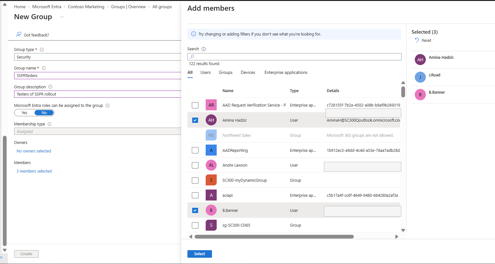
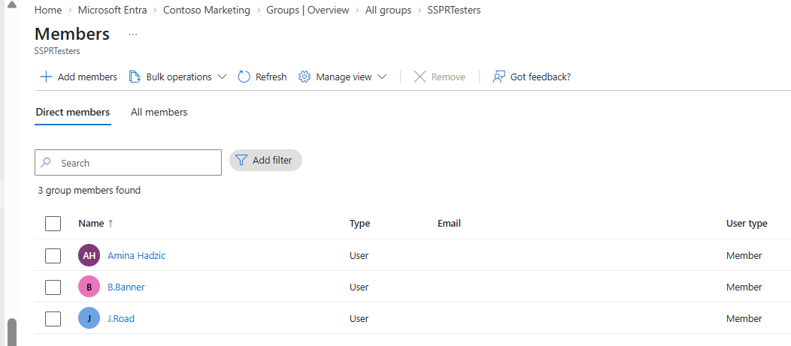
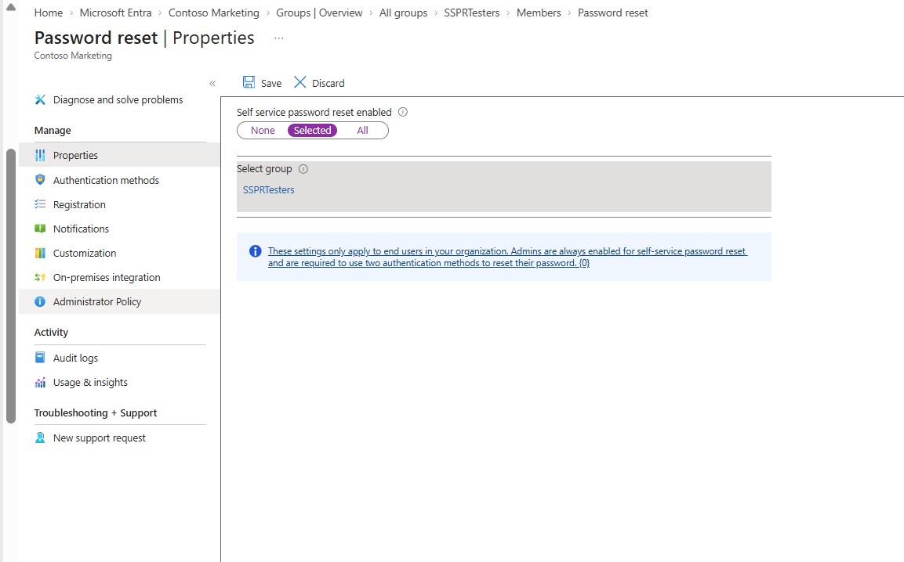
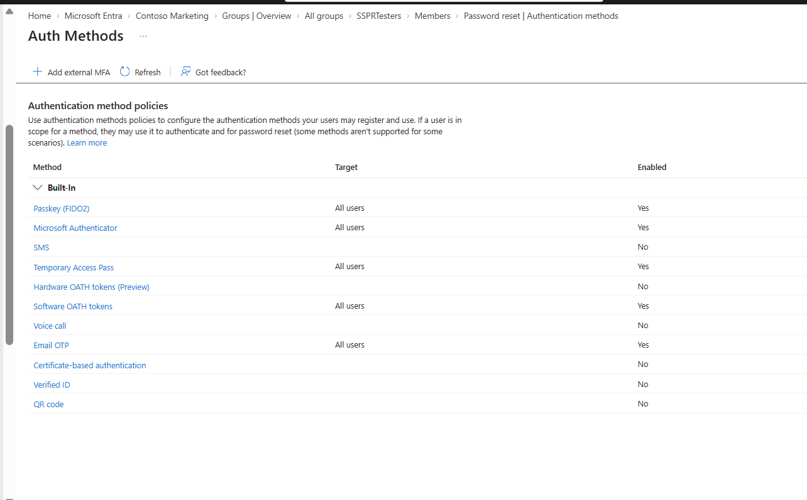
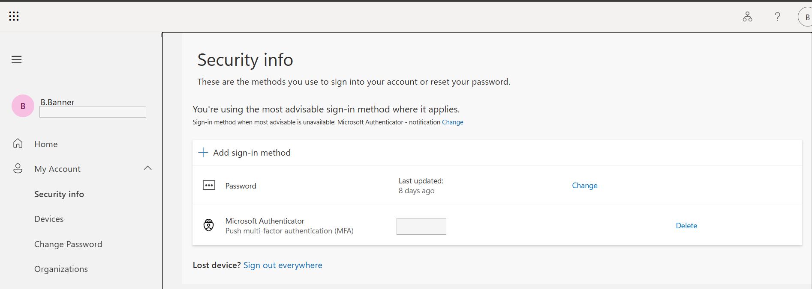
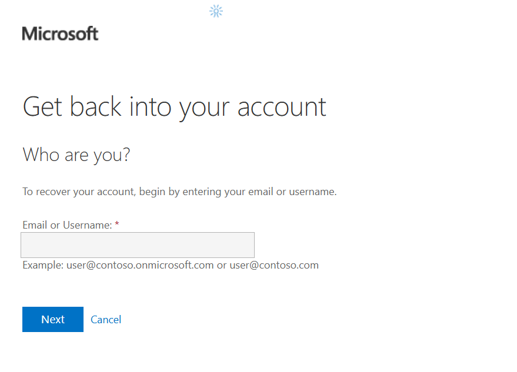
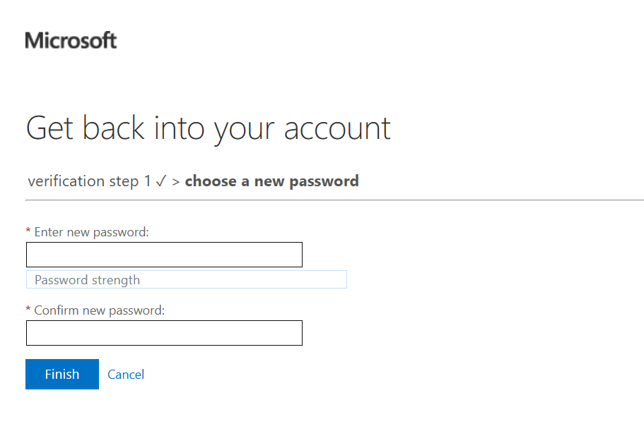

# Lab 09 – Self-Service Password Reset (SSPR)

## Overview

Configured and tested **Self-Service Password Reset (SSPR)** in Microsoft Entra ID using a security group for a controlled rollout.

**Skills:** Entra ID • SSPR • MFA • Microsoft Authenticator • Security Groups • IAM

---

## 1. Created SSPR Test Group

Created the **SSPRTesters** security group and assigned three test users.

---

## 2. Enabled SSPR

Enabled SSPR specifically for the **SSPRTesters** group instead of the entire organization.

---

## 3. Verified Authentication Methods

The current Entra UI manages authentication methods through the **Authentication Methods Policy**. I verified that **Microsoft Authenticator** was enabled and used it for SSPR verification.

The test user already had Microsoft Authenticator registered, so I verified the existing method instead of performing duplicate enrollment.

---

## 4. Tested SSPR

Initiated **Forgot my password** as an SSPR-enabled user.

Completed identity verification and reached the password-reset stage.

Successfully completed the password reset.

---

## 5. Tested Access Control

Tested SSPR with a user **outside the SSPRTesters group**. Microsoft correctly denied self-service password reset.

---

## Key Takeaways

* Deployed SSPR to a controlled security group.
* Used Microsoft Authenticator for identity verification.
* Adapted the lab to Microsoft's current Entra UI.
* Verified both **successful and denied** SSPR scenarios.
* Demonstrated how SSPR can reduce help-desk password-reset workload while maintaining access controls.

---

## Status

**Lab Completed ✅**
