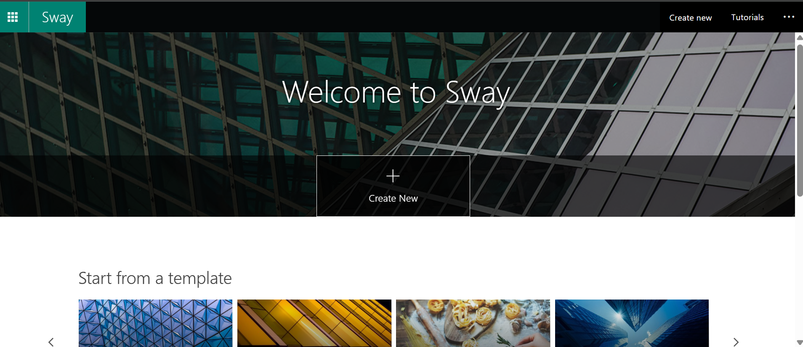
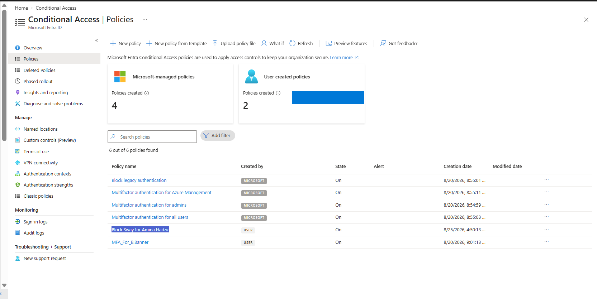
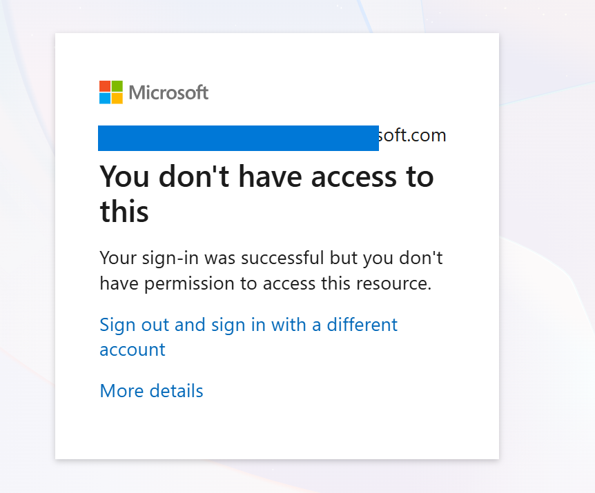
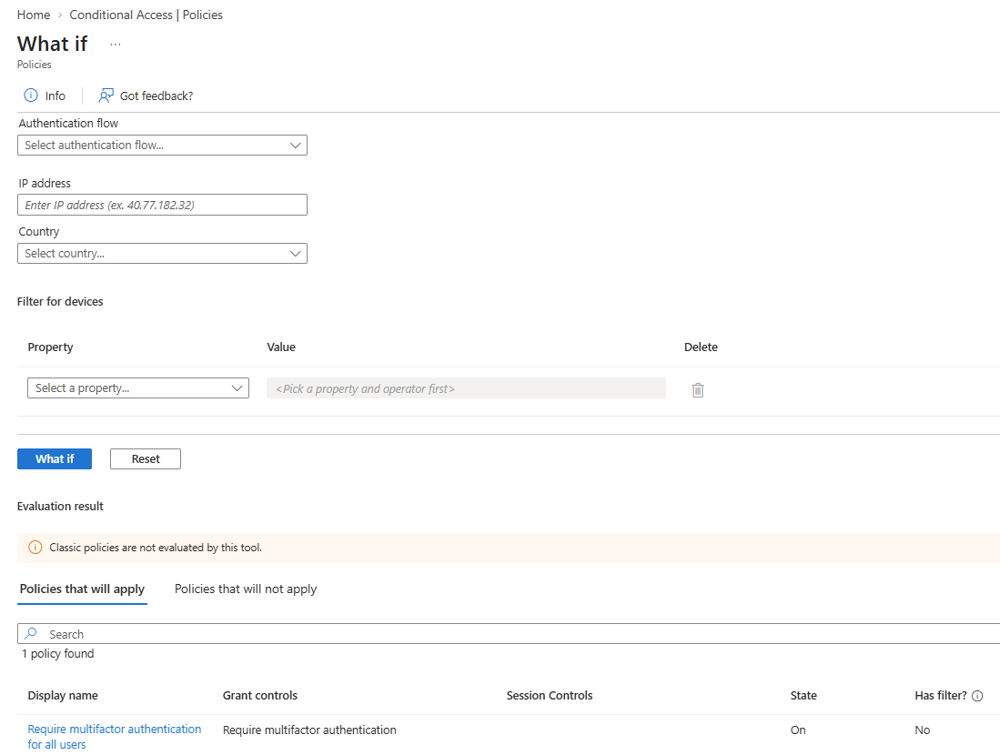
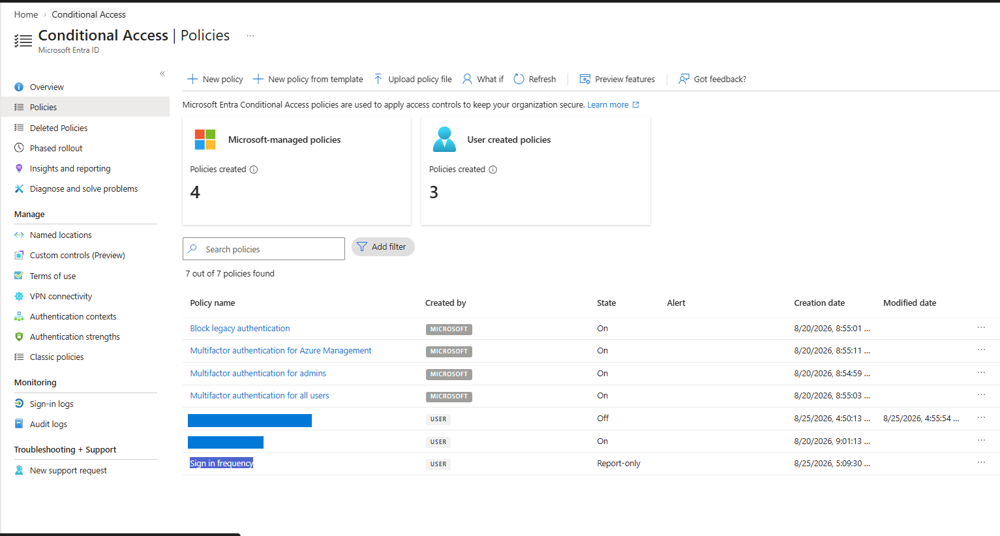

# Lab 13 – Conditional Access Policies

## Overview
Configured and tested Microsoft Entra Conditional Access policies to control user access to cloud applications.

## Tasks Completed
- Assigned a Microsoft 365 license to a test user
- Created a Conditional Access policy to block access to Microsoft Sway
- Verified the access restriction using a test account
- Used the Conditional Access **What If** tool to evaluate policy behavior
- Created a **Sign-in Frequency** policy for Office 365
- Configured the Sign-in Frequency policy in **Report-only** mode

## Screenshots

### 1. Sway Access Before Conditional Access

### 2. Conditional Access Policy Enabled

### 3. Conditional Access Successfully Blocked Sway

### 4. Conditional Access What If Analysis

### 5. Sign-in Frequency Policy in Report-Only Mode

## IAM Relevance
This lab demonstrates how Conditional Access can enforce identity-based security controls, restrict application access, and manage user sessions in Microsoft Entra ID.

## Skills Demonstrated
`Microsoft Entra ID` `Conditional Access` `IAM` `Access Control` `Microsoft 365` `Policy Testing`

## Status
**Lab Completed**
