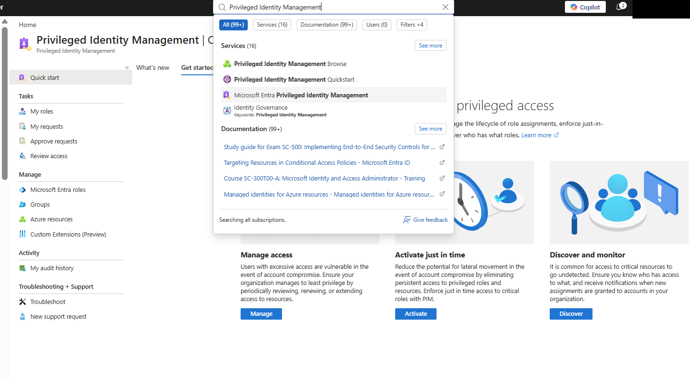
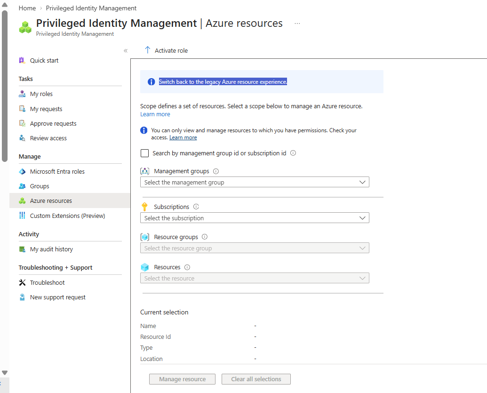
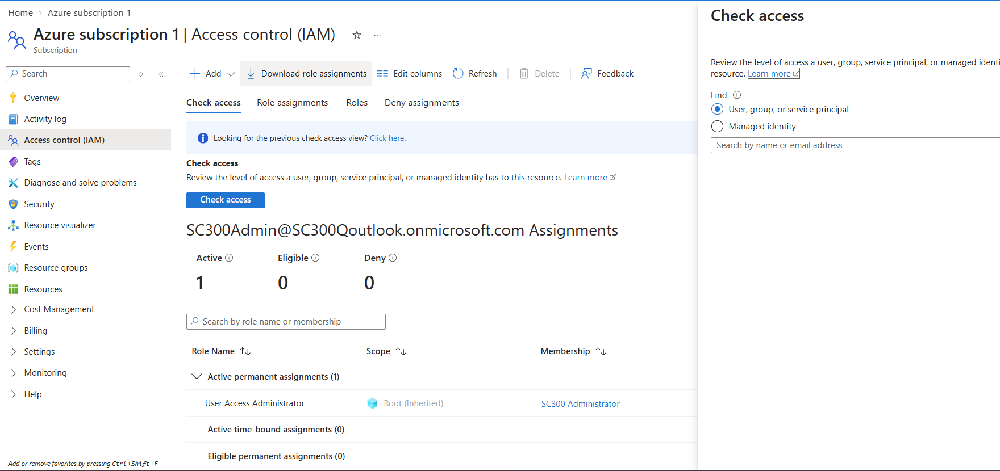
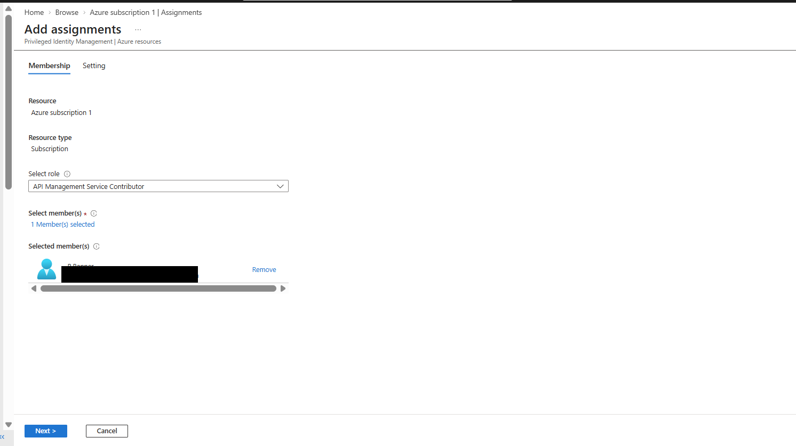
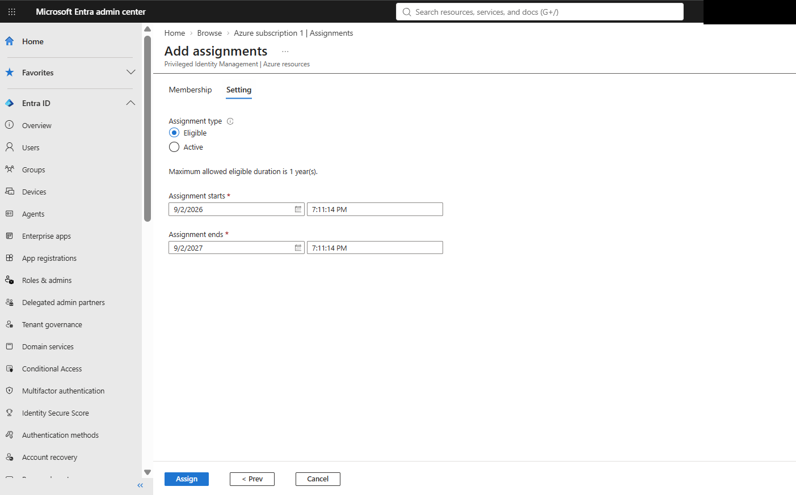
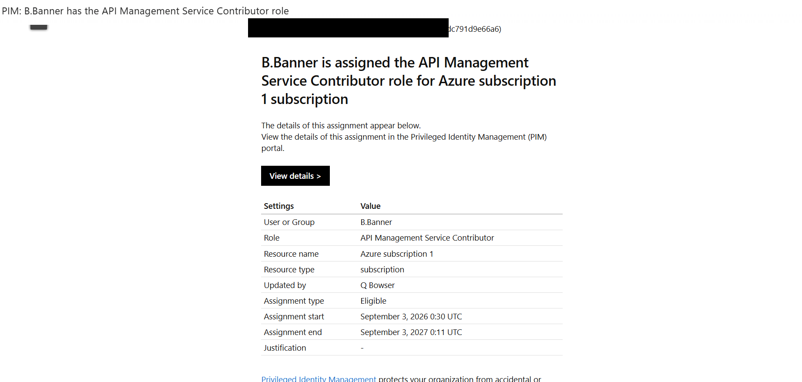
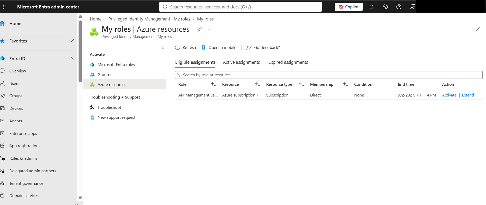
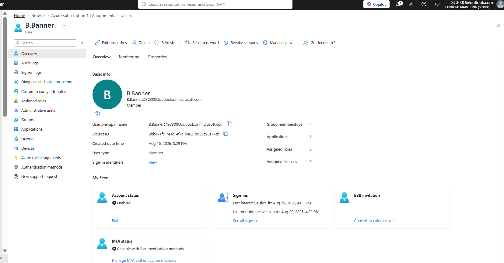
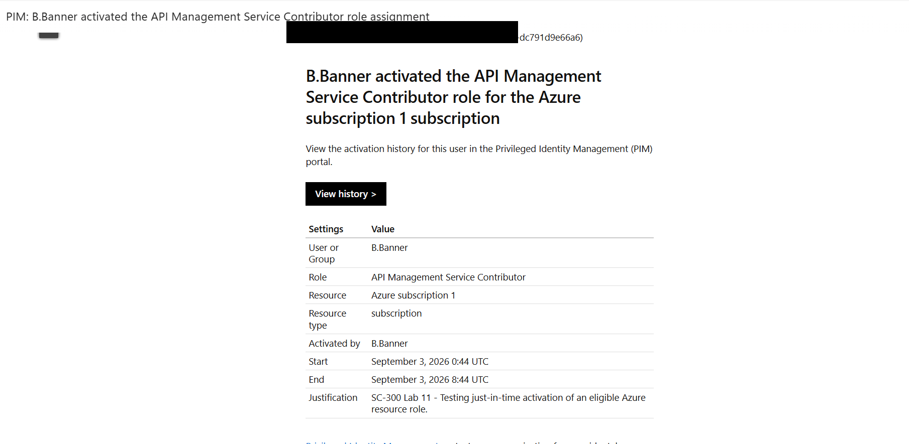

# Lab 11 – Azure Resource Roles with Privileged Identity Management

## Overview

This lab demonstrates using **Microsoft Entra Privileged Identity Management (PIM)** to provide just-in-time privileged access to Azure resources.

I assigned **B.Banner** the **API Management Service Contributor** Azure RBAC role as an **Eligible** assignment, then activated the role temporarily using PIM.

### Skills Demonstrated

- Microsoft Entra Privileged Identity Management (PIM)
- Azure Role-Based Access Control (RBAC)
- Eligible vs. Active role assignments
- Just-in-time (JIT) privileged access
- Time-bound role activation
- Business justification
- Least privilege
- Entra roles vs. Azure resource roles

---

## Current vs. Legacy PIM Experience

The Microsoft SC-300 lab instructions reference the **legacy Azure Resources PIM experience**. I completed the lab using Microsoft's **current Entra PIM interface**.

Although the navigation has changed, the security objective remains the same:

**Azure Resource → Role → Eligible Assignment → Activation → Temporary Active Access**

---

## Entra Roles vs. Azure RBAC

An important lesson from this lab was that **Microsoft Entra roles and Azure RBAC roles control different things**.

- **Entra roles** control identity and directory administration.
- **Azure RBAC roles** control access to Azure resources.

Being a **Global Administrator does not automatically make an administrator an Azure subscription Owner**.

During troubleshooting, Azure resource access was elevated and **User Access Administrator** was verified at the root scope.

---

## Assigning the Azure Resource Role

In PIM, I selected the **API Management Service Contributor** role and assigned it to **B.Banner**.

The assignment was configured as **Eligible** rather than permanently Active.

### Eligible vs. Active

**Eligible**
- Privilege is not continuously available.
- User activates the role when needed.
- Activation can require MFA, justification, approval, and a limited duration.

**Active**
- Permissions are immediately available.
- No activation is required.
- Creates more standing privileged access.

The eligible assignment was successfully created.

---

## Just-in-Time Activation

B.Banner could now see the Azure resource role under **Eligible assignments** with an **Activate** option.

When privileged access was required, the role was activated for a limited duration with a business justification.

Microsoft PIM generated confirmation of the activation.

The role then appeared under **Active assignments** with the state **Activated**.

.png)

---

## Security Concepts

### Just-in-Time Access

PIM follows a simple privileged-access lifecycle:

**Eligible → Activate → Active → Expire**

This reduces **standing privilege** because administrative permissions are available only when required.

### Least Privilege

This lab applied least privilege by controlling:

- **What** permissions were granted
- **Where** they applied
- **When** they became available
- **How long** they remained active

---

## SC-300 Exam Connection

Key decision points from this lab:

| Scenario | Best Choice |
|---|---|
| Temporary privileged access | PIM |
| Reduce standing privilege | Eligible assignment |
| Azure subscription/resource permissions | Azure RBAC |
| Directory/identity administration | Microsoft Entra role |
| Require privilege only when needed | JIT activation |
| Require reason for elevation | Activation justification |

### Remember

**Entra role = identity/directory permissions**

**Azure RBAC role = Azure resource permissions**

**Eligible = can activate**

**Active = has the permissions now**

**PIM = controls the privileged-access lifecycle**

---

## Lab Result

**Status: COMPLETE**

Successfully assigned B.Banner an **Eligible API Management Service Contributor** Azure resource role, verified eligibility, performed just-in-time activation with business justification, and confirmed the role transitioned to an active state for the configured activation period.
