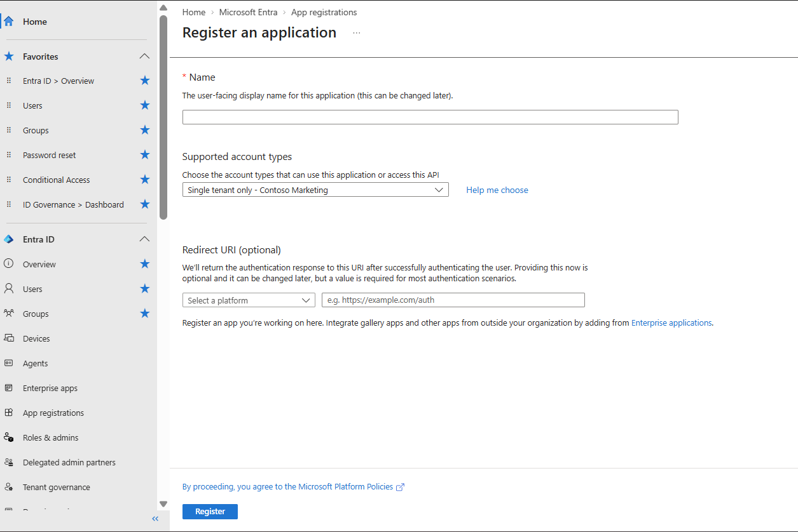
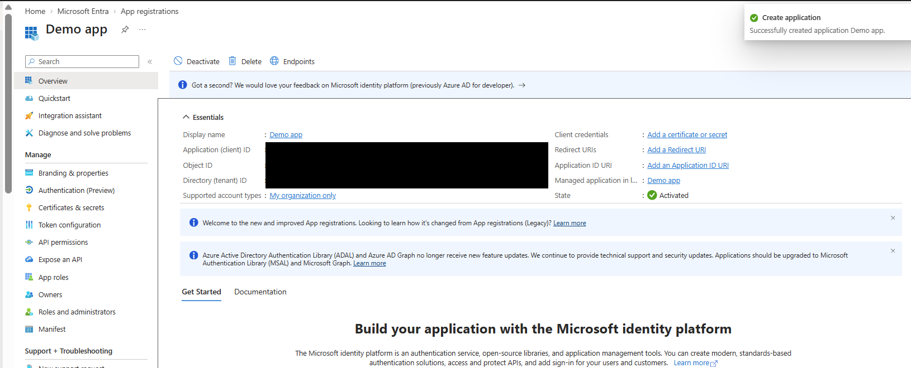
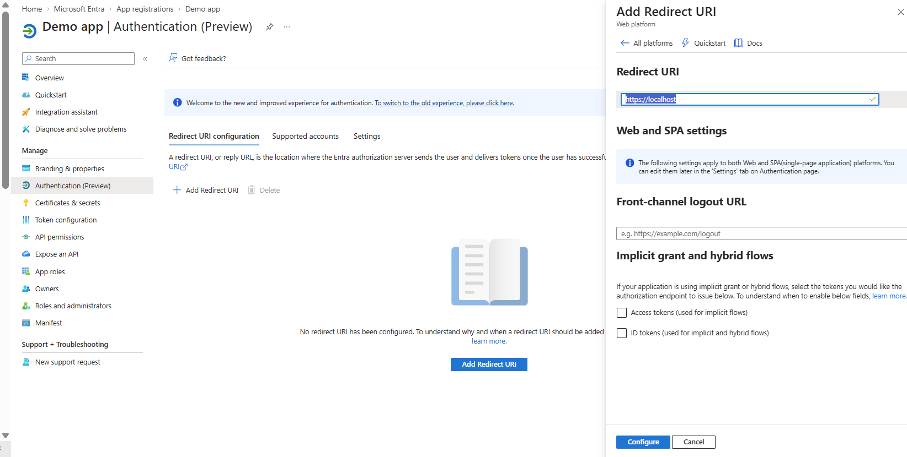
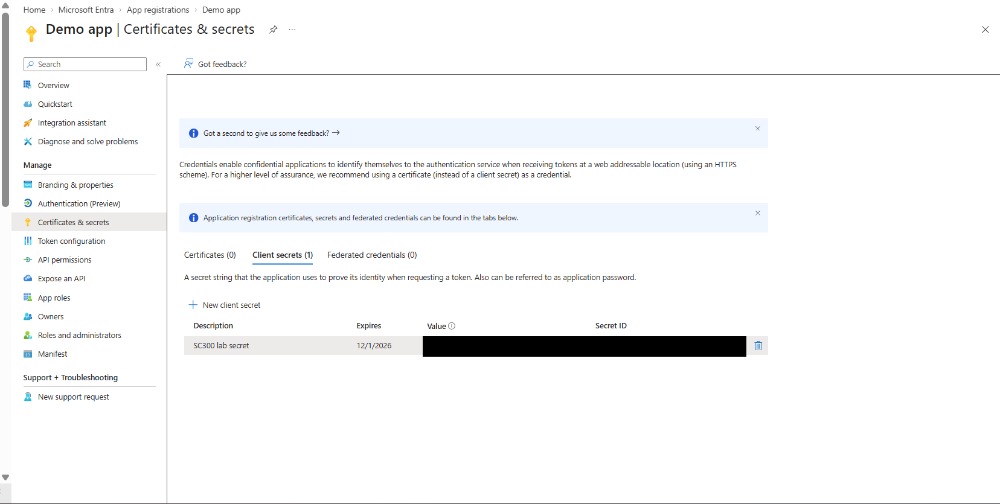
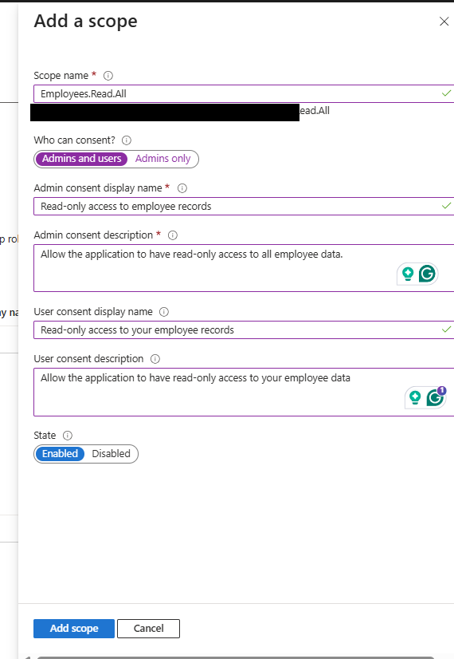
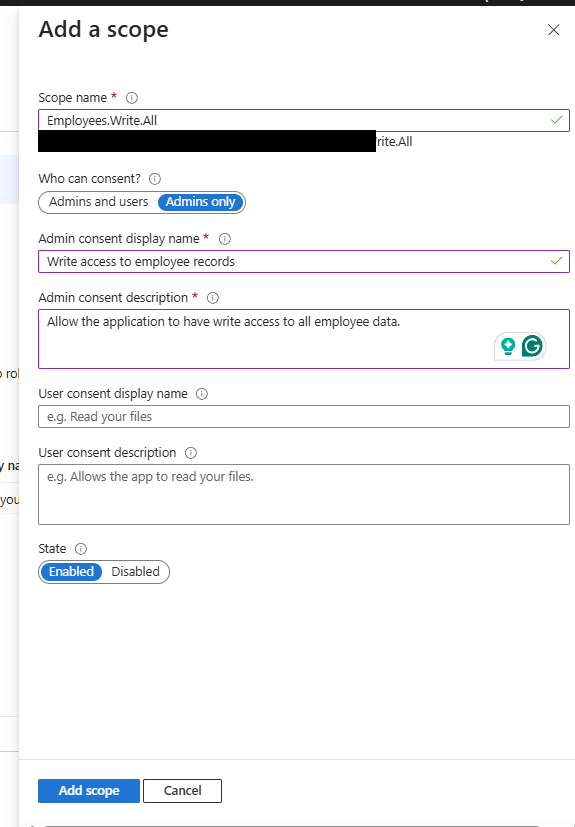
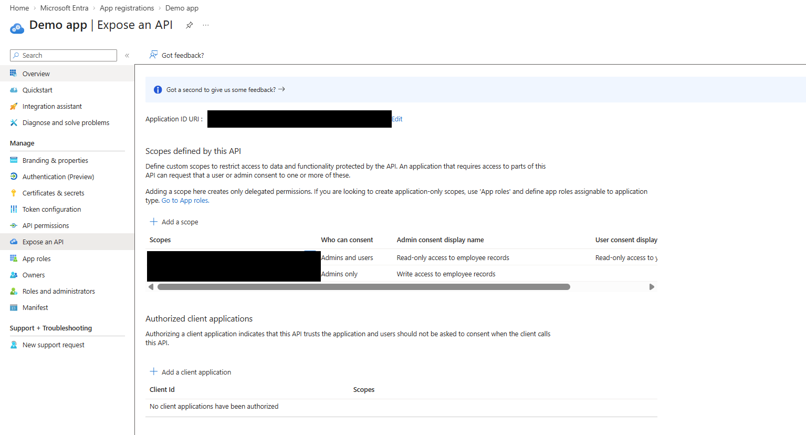
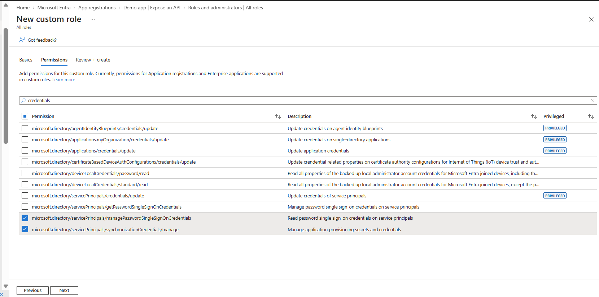
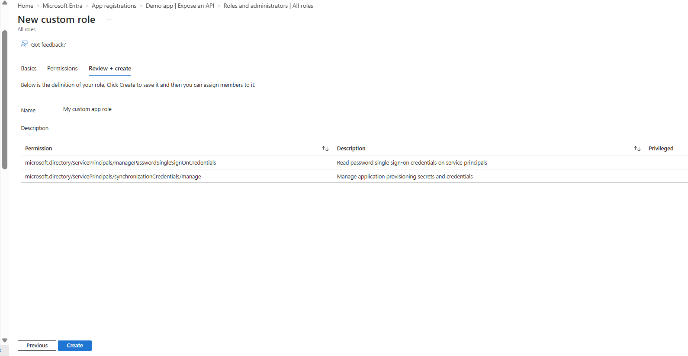
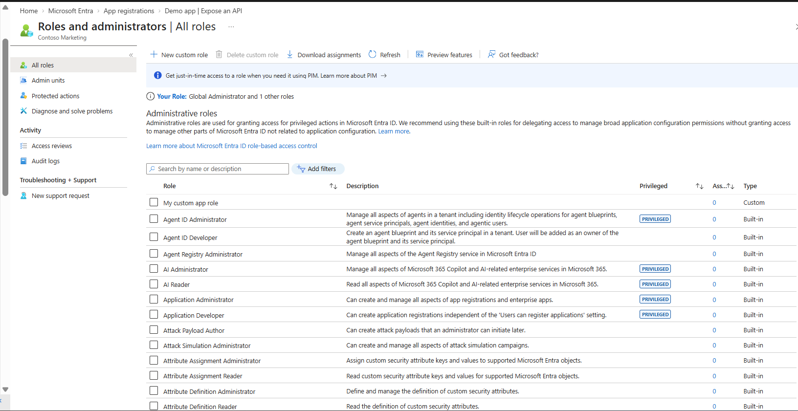

# Lab 19 - Register an Application

## Overview

This lab demonstrates how to register and configure an application in Microsoft Entra ID, configure authentication settings, create application credentials, expose an API, define OAuth 2.0 permission scopes, and create a custom Microsoft Entra role using least-privilege permissions.

The lab provides hands-on experience with application identity, API permissions, application credentials, and role-based access control within Microsoft Entra ID.

---

## Skills Practiced

- Microsoft Entra ID application registration
- Application authentication configuration
- Redirect URI configuration
- Application credentials
- Client secrets
- OAuth 2.0 permission scopes
- API exposure and delegated permissions
- Microsoft Entra custom roles
- Least-privilege access management
- Application and service principal credential management

---

## Exercise 1 - Register and Configure an Application

### Step 1 - Register Demo App

Created a new application registration named **Demo app** within Microsoft Entra ID using the organization's single-tenant configuration.

After registration, verified the application from the Microsoft Entra App registrations overview.

Sensitive application and tenant identifiers shown on the Overview page were redacted before publishing the screenshot to GitHub.

---

### Step 2 - Configure Web Authentication

Configured the application to use the **Web** platform and added the following redirect URI:

`https://localhost`

The redirect URI defines where Microsoft Entra ID can return authentication responses after a user successfully authenticates.

---

### Step 3 - Create Application Credential

Created a client secret named:

`SC300 lab secret`

The client secret provides a credential that a confidential application can use when authenticating to Microsoft Entra ID.

For security, the client secret value and identifying information were redacted before publishing the screenshot to GitHub.

---

## Exercise 2 - Expose an API

### Step 4 - Configure Employees.Read.All Scope

Configured the application to expose an API and created the delegated permission scope:

`Employees.Read.All`

The scope provides read-only access to employee records.

Consent was configured for:

**Admins and users**

---

### Step 5 - Configure Employees.Write.All Scope

Created an additional delegated permission scope:

`Employees.Write.All`

This scope provides write access to employee records.

Consent was restricted to:

**Admins only**

---

### Step 6 - Verify API Scopes

Verified that both delegated permission scopes were successfully configured under **Expose an API**:

- `Employees.Read.All`
- `Employees.Write.All`

This demonstrates how an application can expose different permission levels to client applications through OAuth 2.0 scopes.

Application-specific identifiers were redacted before publishing the screenshot.

---

## Exercise 3 - Create a Custom Application Management Role

### Step 7 - Configure Custom Role Permissions

Created a Microsoft Entra custom role named:

`My custom app role`

The role was configured with permissions related specifically to application and service principal credential management.

Selected permissions included:

`microsoft.directory/servicePrincipals/managePasswordSingleSignOnCredentials`

`microsoft.directory/servicePrincipals/synchronizationCredentials/manage`

This follows the principle of **least privilege** by granting only the permissions required for the intended administrative task.

---

### Step 8 - Review Custom Role

Reviewed the custom role configuration before creation to verify that only the required permissions were included.

This validation step helps prevent unnecessary administrative privileges from being assigned.

---

### Step 9 - Verify Custom Role Creation

Successfully created **My custom app role** in Microsoft Entra ID.

The role appeared under **Roles and administrators**, confirming that the custom role was successfully created and available for assignment.

---

## Security Considerations

Several screenshots generated during this lab contained tenant-specific or application-specific information.

Before publishing the screenshots to this public GitHub portfolio, sensitive information was redacted, including:

- Application (client) ID
- Object ID
- Directory (tenant) ID
- Application ID URI identifiers
- Client secret value
- Client secret identifiers

The screenshots retain the configuration information necessary to demonstrate the completed lab while avoiding unnecessary exposure of tenant and application identifiers.

---

## Troubleshooting / Lessons Learned

During the application registration process, tenant security controls affected how application configuration could be completed.

This demonstrated that Microsoft Entra application administration is influenced not only by application settings but also by tenant-level security policies and identity governance controls.

The lab also reinforced the importance of understanding the relationship between:

- Application registrations
- Service principals
- Authentication settings
- Application credentials
- OAuth 2.0 scopes
- Consent
- Microsoft Entra administrative roles

---

## Key Takeaways

This lab provided hands-on experience with the relationship between **application registration, authentication, API permissions, consent, and Microsoft Entra roles**.

Creating separate read and write scopes demonstrated how APIs can expose different levels of delegated access and how consent requirements can be adjusted based on the sensitivity of the permission.

Creating a custom Microsoft Entra role demonstrated how administrative access can be delegated using the **principle of least privilege** rather than granting broad application administration capabilities.

The lab also reinforced the security importance of protecting application credentials and tenant-specific identifiers when documenting cloud environments in a public portfolio.

---

## Technologies Used

- Microsoft Entra ID
- Microsoft Entra Admin Center
- App Registrations
- Microsoft identity platform
- OAuth 2.0
- Delegated API permissions
- Application credentials
- Client secrets
- Microsoft Entra RBAC
- Microsoft Entra custom roles

---

## Portfolio Evidence

| Screenshot | Evidence |
|---|---|
| `01-App-Registration.png` | Application registration configuration |
| `02-Demo-App-Overview.png` | Registered Demo app overview |
| `03-Web-Redirect-URI.png` | Web authentication and redirect URI |
| `04-Client-Secret-Created.png` | Application client secret |
| `05-Employees-Read-Scope.png` | Employees.Read.All delegated scope |
| `06-Employees-Write-Scope.png` | Employees.Write.All delegated scope |
| `07-API-Scopes-Configured.png` | Verification of exposed API scopes |
| `08-Custom-Role-Permissions.png` | Least-privilege custom role permissions |
| `09-Custom-Role-Review.png` | Custom role configuration review |
| `10-Custom-Role-Created.png` | Successful custom role creation |

---

## Lab Status

**Lab 19 - Register an Application: COMPLETE**
