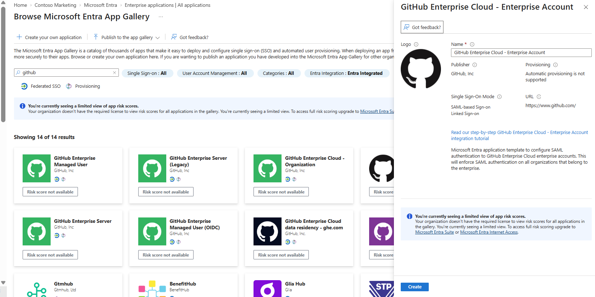
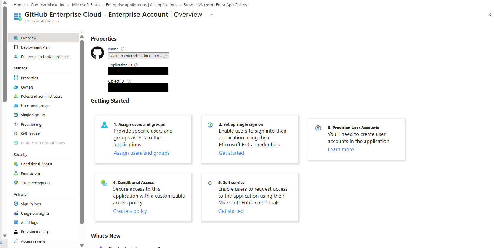
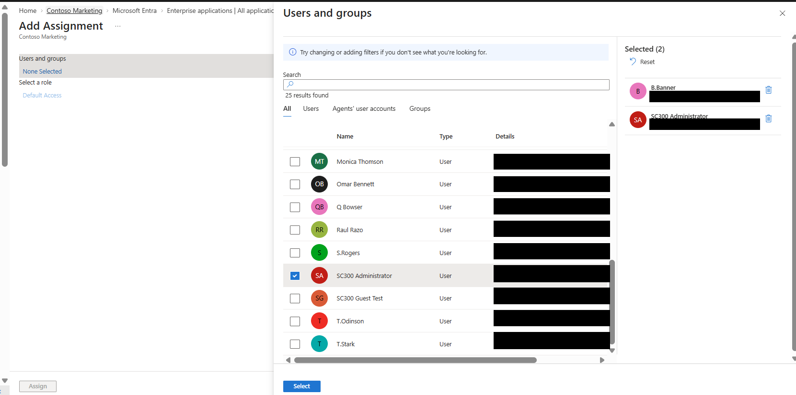
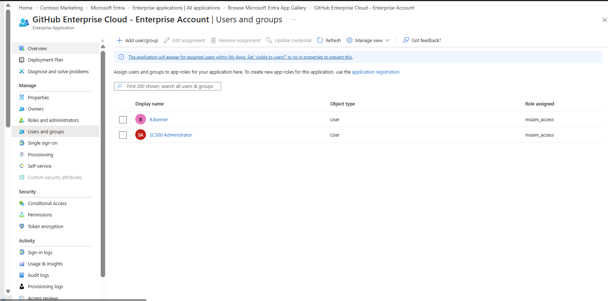

# Lab 20 - Enterprise Applications

## Overview

This lab demonstrates how to add and manage an **Enterprise Application** in Microsoft Entra ID.

The lab focused on selecting an application from the Microsoft Entra application gallery, creating the enterprise application in the tenant, and assigning specific users who are authorized to access the application.

For this lab, **GitHub Enterprise Cloud - Enterprise Account** was added from the Microsoft Entra application gallery.

---

## Skills Practiced

- Microsoft Entra Enterprise Applications
- Microsoft Entra application gallery
- Enterprise application deployment
- Service principal management
- User assignment
- Application access management
- Identity-based application access
- Least-privilege access control

---

## Exercise 1 - Add an Enterprise Application

### Step 1 - Select GitHub Enterprise Cloud

Navigated to the **Microsoft Entra application gallery** and searched for GitHub.

Selected:

**GitHub Enterprise Cloud - Enterprise Account**

The application gallery provides pre-integrated SaaS applications that organizations can add to Microsoft Entra ID for centralized identity and access management.

---

### Step 2 - Verify the Enterprise Application

After adding the application, verified that **GitHub Enterprise Cloud - Enterprise Account** was successfully created as an Enterprise Application.

The Enterprise Application represents the application's **service principal** within the tenant.

This is the tenant-specific identity that administrators manage when configuring access, user assignments, Single Sign-On, Conditional Access, and other application controls.

Application-specific identifiers were redacted before publishing the screenshot to GitHub.

---

## Exercise 2 - Assign Users to the Enterprise Application

### Step 3 - Select Users

Navigated to:

**Enterprise Applications → GitHub Enterprise Cloud - Enterprise Account → Users and groups**

Selected two users for application access:

- B.Banner
- SC300 Administrator

Assigning users determines which identities are authorized to access the enterprise application when assignment is required.

---

### Step 4 - Verify User Assignments

Completed the assignment and verified that both users appeared under **Users and groups**.

Both users were successfully associated with the enterprise application.

This demonstrates how Microsoft Entra administrators can centrally control which identities receive access to an application.

---

## App Registration vs Enterprise Application

An important concept reinforced by this lab is the difference between an **App Registration** and an **Enterprise Application**.

### App Registration

An App Registration defines the application identity and how the application interacts with Microsoft Entra ID.

It can include:

- Application (client) ID
- Redirect URIs
- Certificates and client secrets
- API permissions
- OAuth scopes
- App roles

Think of the **App Registration as the application's identity definition or blueprint**.

### Enterprise Application

An Enterprise Application represents the application's **service principal inside a specific tenant**.

Administrators use the Enterprise Application to manage:

- User and group assignments
- Single Sign-On
- Conditional Access
- Provisioning
- Permissions
- Sign-in activity
- Access reviews

Think of the **Enterprise Application as the tenant's working instance of the application**.

---

## SC-300 Exam Connection

A useful way to remember the distinction for the SC-300 exam is:

**App Registration = What is the application?**

**Enterprise Application = Who can use it and how is access managed in this tenant?**

For example:

If a scenario asks you to configure a **redirect URI, client secret, API permission, or application authentication setting**, think:

**App Registration**

If a scenario asks you to **assign users, configure SSO, apply Conditional Access, review application access, or manage provisioning**, think:

**Enterprise Application**

---

## Security Considerations

Enterprise application assignments help organizations control application access according to the principle of **least privilege**.

Rather than automatically allowing every identity in the organization to access an application, administrators can assign only the users or groups that require access.

Screenshots containing application-specific identifiers were redacted before being published to this public GitHub portfolio.

---

## Key Takeaways

This lab demonstrated how Microsoft Entra ID provides centralized control over access to cloud applications.

The Microsoft Entra application gallery simplifies the process of integrating supported applications into an organization's identity environment.

The most important concept from this lab is understanding the relationship between an **application object and a service principal**.

The App Registration represents the application's identity definition, while the Enterprise Application represents the service principal used to manage that application's access within a tenant.

User and group assignments then determine which identities are authorized to access the enterprise application.

This separation is important for understanding Microsoft Entra application management and is a key concept for the **SC-300 Identity and Access Administrator exam**.

---

## Technologies Used

- Microsoft Entra ID
- Microsoft Entra Admin Center
- Enterprise Applications
- Microsoft Entra Application Gallery
- Service Principals
- User and Group Assignment
- Identity and Access Management
- Role-Based Access Control

---

## Portfolio Evidence

| Screenshot | Evidence |
|---|---|
| `01-GitHub-Enterprise-App-Selected.png` | GitHub Enterprise Cloud selected from the Microsoft Entra application gallery |
| `02-GitHub-Enterprise-App-Overview.png` | Enterprise Application successfully created in the tenant |
| `03-Enterprise-App-Users-Selected.png` | Users selected for application access |
| `04-Enterprise-App-Users-Assigned.png` | Successful enterprise application user assignments |

---

## Lab Status

**Lab 20 - Enterprise Applications: COMPLETE**
