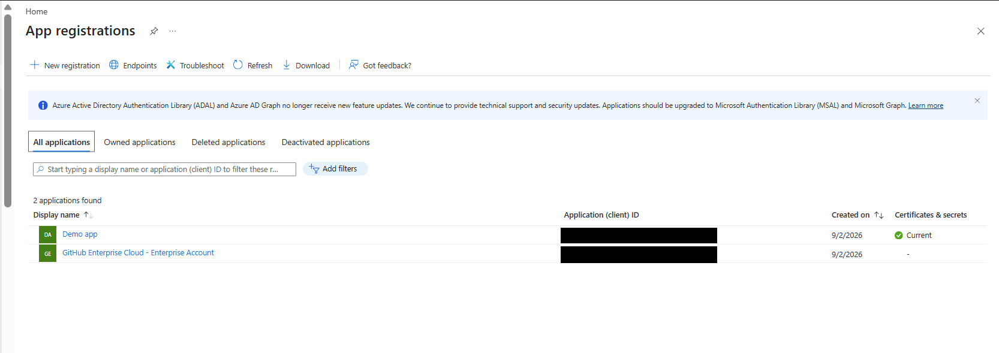
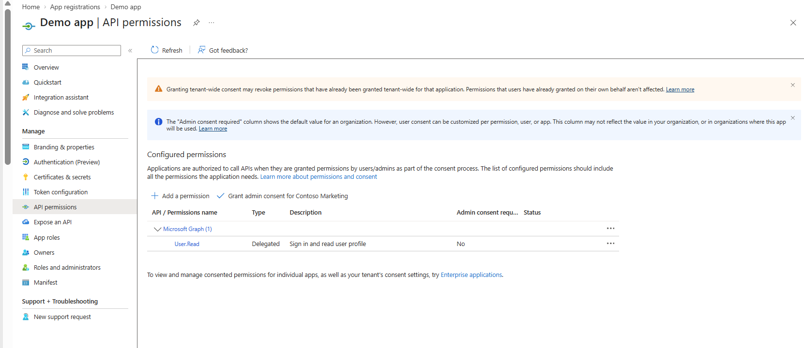
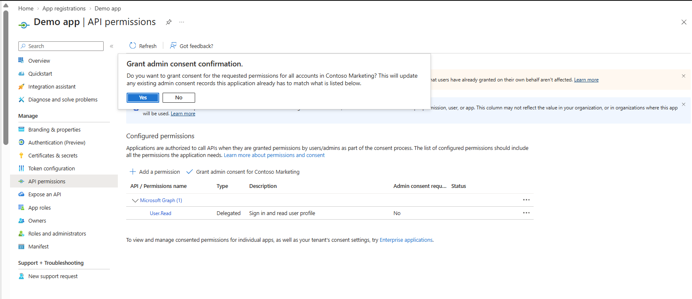
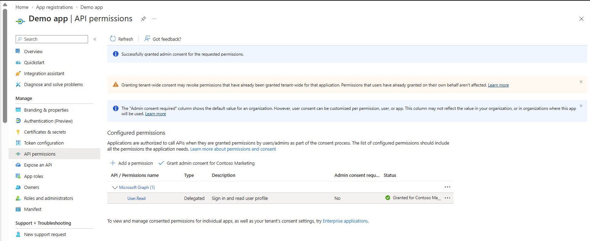
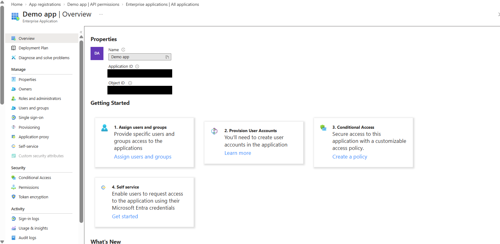
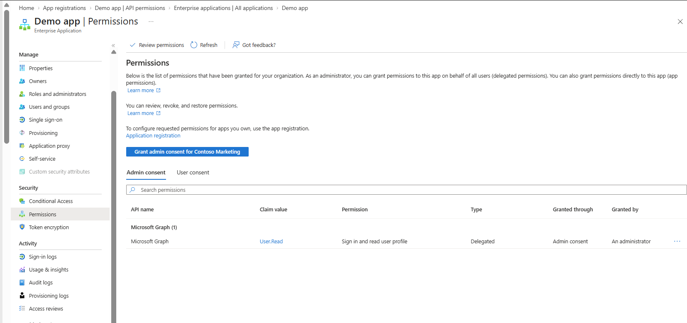
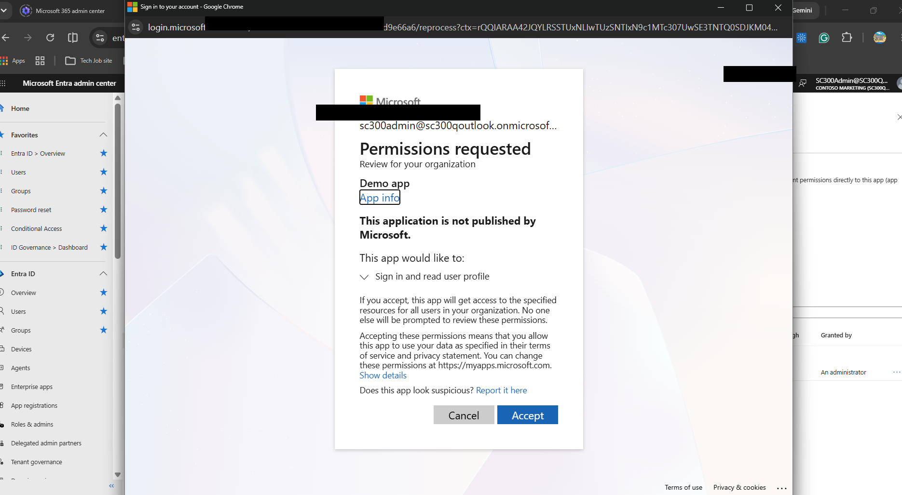
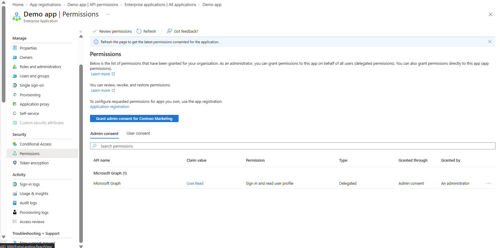

# Lab 21 - Configure Application Permissions

## Overview

This lab demonstrates how application permissions and consent are configured and managed in Microsoft Entra ID.

The lab focused on reviewing API permissions for an existing App Registration, examining a delegated Microsoft Graph permission, granting tenant-wide administrator consent, and verifying the resulting permission through the application's Enterprise Application.

The lab reinforces the relationship between:

- App Registrations
- Enterprise Applications
- Service principals
- Microsoft Graph
- API permissions
- Delegated permissions
- User consent
- Administrator consent

---

## Skills Practiced

- Microsoft Entra application management
- App Registration administration
- Enterprise Application administration
- Microsoft Graph API permissions
- Delegated permissions
- Administrator consent
- Tenant-wide consent
- Service principal permission verification
- Application permission governance
- Least-privilege access management

---

## Exercise 1 - Review the Application Registration

### Step 1 - Locate the Application Registration

Navigated to:

**Microsoft Entra ID → App registrations → All applications**

Verified the existing **Demo app** created during the previous application registration lab.

This page shows applications registered within the Microsoft Entra tenant.

Application identifiers were redacted before publishing the screenshot to GitHub.

---

### Step 2 - Review the Demo App

Opened the **Demo app** App Registration and reviewed its configuration.

The App Registration represents the application's identity definition in Microsoft Entra ID.

From the App Registration, administrators can configure items such as:

- Authentication
- Redirect URIs
- Certificates and secrets
- API permissions
- Exposed APIs
- App roles
- Application ownership

Application and tenant identifiers were redacted before publishing this screenshot.

.png)

---

## Exercise 2 - Review API Permissions

### Step 3 - Review Microsoft Graph Permission

Navigated to:

**Demo app → API permissions**

The application had the following Microsoft Graph permission configured:

`User.Read`

Permission type:

**Delegated**

Description:

**Sign in and read user profile**

A delegated permission means the application accesses a resource **on behalf of a signed-in user**.

The application is therefore limited by both the permission granted to the application and the privileges available to the signed-in user.

---

## Exercise 3 - Grant Administrator Consent

### Step 4 - Grant Admin Consent

Selected:

**Grant admin consent for Contoso Marketing**

Microsoft Entra displayed a confirmation prompt before granting the requested permissions across the organization.

Administrator consent allows an authorized administrator to approve permissions on behalf of users in the tenant rather than requiring each user to consent individually.

---

### Step 5 - Verify Admin Consent

Confirmed the administrator consent request.

Microsoft Entra displayed:

**Successfully granted admin consent for the requested permissions.**

The `User.Read` permission then showed a granted status for the organization.

This confirmed that administrator consent had been successfully recorded for the delegated Microsoft Graph permission.

---

## Exercise 4 - Examine the Enterprise Application

### Step 6 - Locate the Enterprise Application

Navigated from the App Registration to the corresponding **Demo app Enterprise Application**.

This demonstrates an important Microsoft Entra concept:

**App Registration = Application object**

**Enterprise Application = Service principal**

The App Registration defines the application.

The Enterprise Application represents the application's identity and access configuration within the tenant.

Application and object identifiers were redacted before publishing the screenshot.

---

### Step 7 - Review Enterprise Application Permissions

Navigated to:

**Enterprise Applications → Demo app → Permissions**

The Microsoft Graph `User.Read` delegated permission appeared under the application's permissions.

The permission showed:

- API: Microsoft Graph
- Claim value: `User.Read`
- Permission: Sign in and read user profile
- Type: Delegated
- Granted through: Admin consent
- Granted by: An administrator

This demonstrates how consent granted through the App Registration is reflected on the application's service principal.

---

## Exercise 5 - Review Tenant-Wide Consent

### Step 8 - Review the Permission Consent Prompt

Reviewed the organizational permission consent screen for the Demo app.

The application requested permission to:

**Sign in and read user profile**

The consent screen explained that accepting the request would allow the application to access the specified resources for users in the organization.

This step demonstrates the user-facing impact of administrator consent.

Sensitive account and tenant information was redacted before publishing the screenshot.

---

### Step 9 - Verify Enterprise Application Consent

Returned to the Enterprise Application permissions page and verified the Microsoft Graph permission.

The final configuration showed:

`User.Read`

as a **Delegated** permission granted through **Admin consent** by **An administrator**.

This provided final verification that the consent configuration was associated with the Enterprise Application/service principal.

---

## Delegated vs Application Permissions

Understanding the difference between **Delegated permissions** and **Application permissions** is important for the SC-300 exam.

### Delegated Permission

A delegated permission is used when:

**A user is signed in and the application acts on behalf of that user.**

Conceptually:

`User → Application → API`

Example from this lab:

`User.Read`

The application can sign in the user and read the signed-in user's profile.

Think:

**Delegated = App + signed-in user**

---

### Application Permission

An application permission is used when:

**The application accesses the API as itself without a signed-in user.**

Conceptually:

`Application → API`

These permissions are commonly used by:

- Background services
- Daemons
- Automated processes
- Server-to-server applications

Application permissions generally require administrator consent because the application can operate without a user being present.

Think:

**Application permission = App acts by itself**

---

## User Consent vs Admin Consent

### User Consent

User consent allows an individual user to approve certain permissions for an application, depending on the organization's consent policies and the sensitivity of the requested permission.

Think:

**User approves access for themselves.**

### Admin Consent

Admin consent allows an authorized administrator to approve permissions on behalf of the organization.

Think:

**Administrator approves access at the organizational level.**

This lab demonstrated **administrator consent**.

---

## SC-300 Exam Connection

A useful way to approach application permission questions on the SC-300 exam is to first determine:

### Is a user signed in?

If **yes**, consider:

**Delegated permission**

If **no** and the application must operate independently, consider:

**Application permission**

---

### Who needs to approve the permission?

If an individual user can approve the requested access under the organization's consent policy:

**User consent may be appropriate.**

If the permission requires organizational approval or the application requires broader access:

**Admin consent may be required.**

---

### Where are permissions configured?

If the question asks you to configure what an application **requests from an API**, think:

**App Registration → API permissions**

If the question asks you to review permissions or consent associated with the application's tenant instance, think:

**Enterprise Application → Permissions**

---

## App Registration, Enterprise Application, and API Relationship

The labs can be remembered as the following relationship:

`App Registration → defines the application`

`Enterprise Application → represents the application in the tenant`

`API Permission → defines what the application may request`

`Consent → authorizes that requested access`

`Microsoft Graph → API providing access to Microsoft 365 and Entra resources`

For this lab:

`Demo app → Microsoft Graph → User.Read → Delegated → Admin Consent`

That sequence is the core identity flow demonstrated during the lab.

---

## Security Considerations

Application permissions should follow the **principle of least privilege**.

Applications should receive only the API permissions necessary to perform their intended function.

Administrators should evaluate:

- What API the application is accessing
- What permission is being requested
- Whether the permission is delegated or application-based
- Whether administrator consent is required
- Which users or resources could be affected
- Whether the application's permissions remain necessary

Administrator consent should be carefully controlled because it can authorize application access across an organization.

Sensitive tenant, account, and application identifiers visible during the lab were redacted before screenshots were published to this public GitHub portfolio.

---

## Key Takeaways

This lab demonstrated how Microsoft Entra controls application access to APIs through permissions and consent.

The `User.Read` permission demonstrated a **delegated Microsoft Graph permission**, where an application accesses Microsoft Graph on behalf of a signed-in user.

Granting administrator consent demonstrated how an administrator can authorize requested permissions at the organizational level.

Reviewing the Enterprise Application demonstrated that permissions and consent are ultimately associated with the application's service principal within the tenant.

The most important concepts reinforced by this lab are:

**Delegated = application acts on behalf of a user**

**Application = application acts as itself**

**App Registration = application definition**

**Enterprise Application = service principal in the tenant**

**API permission = what access the application requests**

**Consent = approval allowing that requested access**

---

## Technologies Used

- Microsoft Entra ID
- Microsoft Entra Admin Center
- App Registrations
- Enterprise Applications
- Service Principals
- Microsoft Graph
- API Permissions
- Delegated Permissions
- Administrator Consent
- OAuth 2.0
- Microsoft Identity Platform

---

## Portfolio Evidence

| Screenshot | Evidence |
|---|---|
| `01-App-Registrations-All-Applications.png` | Existing application registrations |
| `02-Demo-App-Overview(3).png` | Demo app App Registration overview |
| `03-API-Permissions-Before-Admin-Consent.png` | Microsoft Graph User.Read delegated permission |
| `04-Admin-Consent-Confirmation.png` | Administrator consent confirmation |
| `05-Admin-Consent-Granted-App-Registration.png` | Successful administrator consent |
| `06-Demo-App-Enterprise-Application.png` | Demo app Enterprise Application/service principal |
| `07-Enterprise-App-Permissions.png` | Enterprise Application permission details |
| `08-Tenant-Wide-Permissions-Requested.png` | Organizational permission consent screen |
| `09-Enterprise-App-Admin-Consent-Verified.png` | Final verification of admin consent |

---

## Lab Status

**Lab 21 - Configure Application Permissions: COMPLETE**
