# Lab 22 – Microsoft Entra Entitlement Management

## Objective
Created and managed a Microsoft Entra Entitlement Management catalog and access package to provide governed access to organizational resources.

## What I Completed
- Created the **Marketing** catalog.
- Added the **Northwest Sales** Microsoft 365 group as a resource.
- Created the **Marketing Access** access package.
- Configured an approval-based access request policy.
- Submitted an access request as **B.Banner**.
- Used **T.Stark** as the approver.
- Approved and delivered the requested access.
- Verified B.Banner was added to the Northwest Sales group.

## Troubleshooting

During testing, the initial **B.Banner** request could not be approved as expected because B.Banner was involved in both the request and approval workflow.

To correct the issue, I updated the approval process to use **T.Stark as the approver** and resubmitted the Marketing Access request.

T.Stark successfully reviewed and approved the request. Microsoft Entra Entitlement Management then delivered the access to B.Banner.

**Lesson learned:** Requester and approver roles should be separated to maintain an effective access governance and approval workflow.

## Screenshots

### 01 – Configure Marketing Catalog
Configured the new **Marketing** catalog for internal access requests.

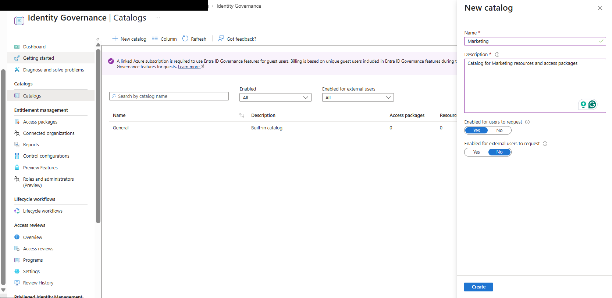

### 02 – Marketing Catalog Created
Verified the **Marketing** catalog was successfully created and enabled.

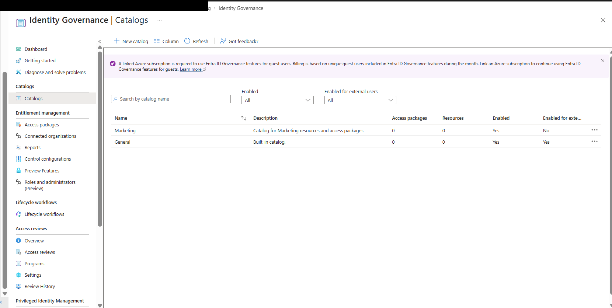

### 03 – Select Northwest Sales Resource
Selected the **Northwest Sales** Microsoft 365 group as a governed resource.

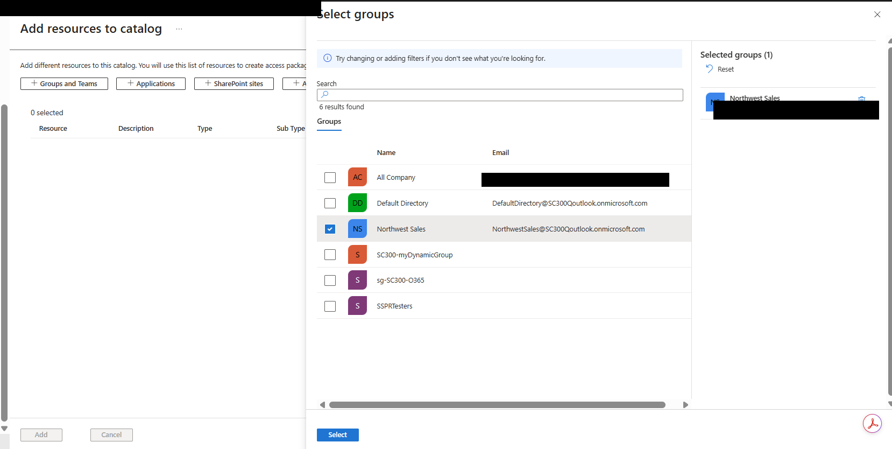

### 04 – Northwest Sales Resource Selected
Confirmed **Northwest Sales** as the resource to add to the Marketing catalog.

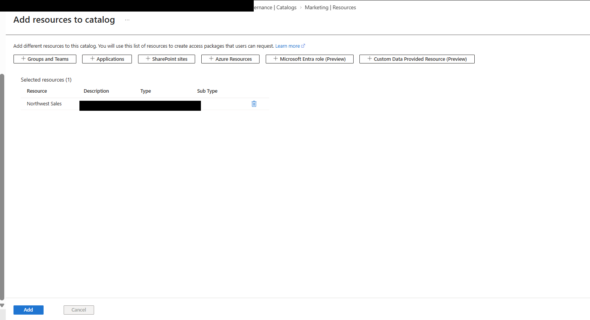

### 05 – Northwest Sales Resource Added
Verified the **Northwest Sales** group was successfully added to the catalog.

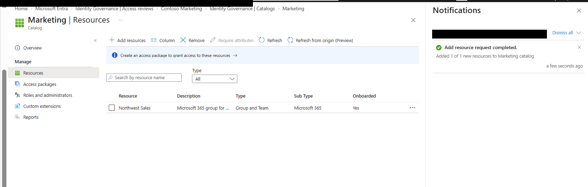

### 06 – Create Marketing Access Package
Created the **Marketing Access** package for governed access to Marketing resources.

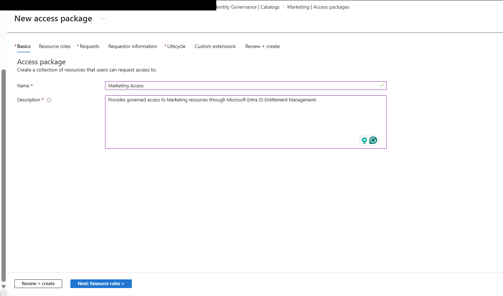

### 07 – Marketing Access Package Created
Verified the access package was created with the Northwest Sales resource and an enabled policy.

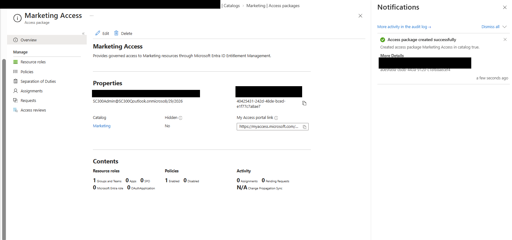

### 08 – Marketing Access Request
Used the **My Access** portal to request the Marketing Access package.

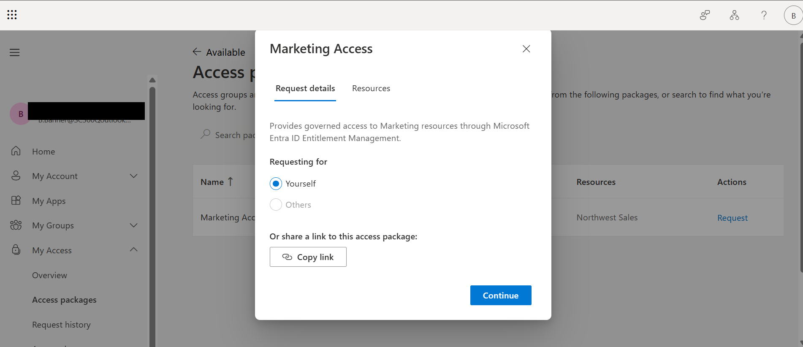

### 09 – Marketing Access Pending Approval
Verified the submitted request entered **Pending approval** status.

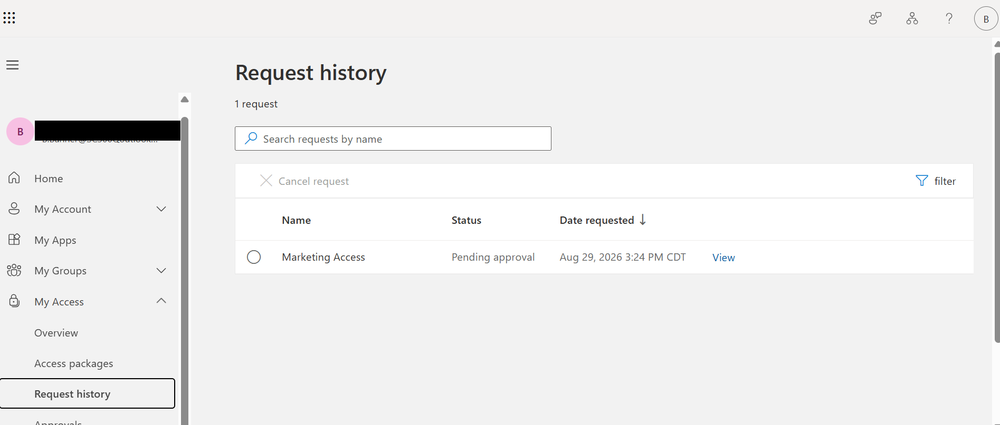

### 10 – B.Banner Pending Access Request
Confirmed B.Banner's request was waiting for approval under the configured policy.

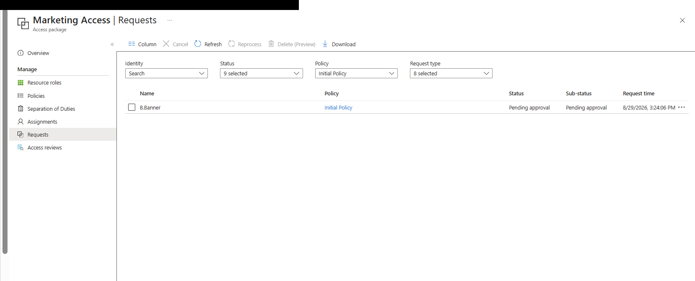

### 11 – T.Stark Approval Queue
Used **T.Stark** as the separate approver and located B.Banner's request.

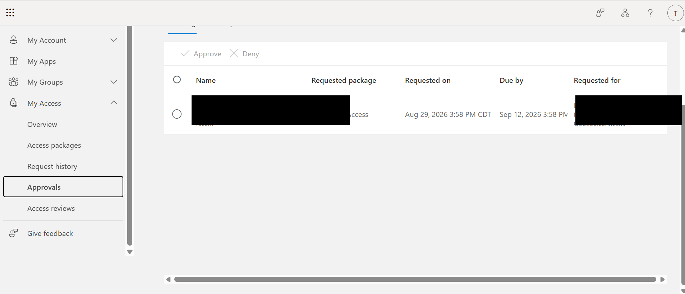

### 12 – Approve Marketing Access
T.Stark approved the request and provided a reason for granting access.

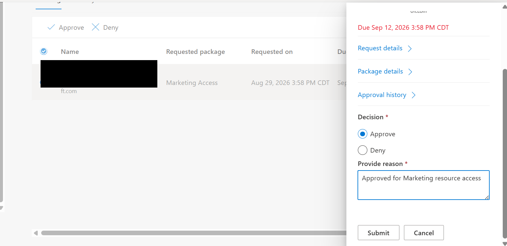

### 13 – Approval Successful
Verified that T.Stark successfully approved B.Banner's Marketing Access request.

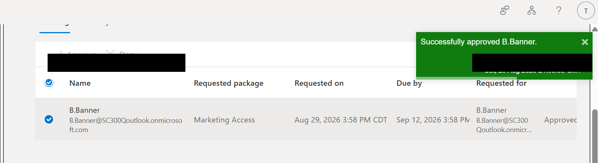

### 14 – Access Delivered
Confirmed the approval and provisioning workflow reached **Delivered** status.

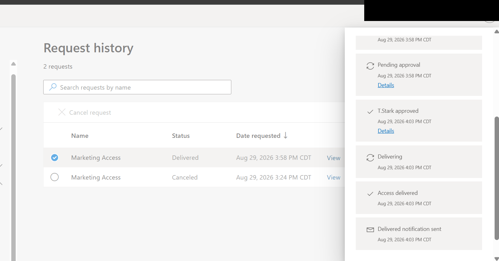

### 15 – Membership Verification
Verified **B.Banner** was added to the **Northwest Sales** group after approval.

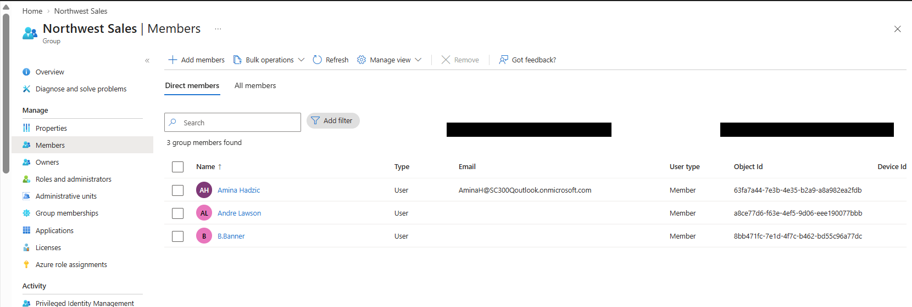

## Skills Demonstrated
Microsoft Entra ID • Identity Governance • Entitlement Management • Access Packages • Catalogs • Approval Workflows • Access Provisioning • Troubleshooting

## Status
**Lab Completed**
