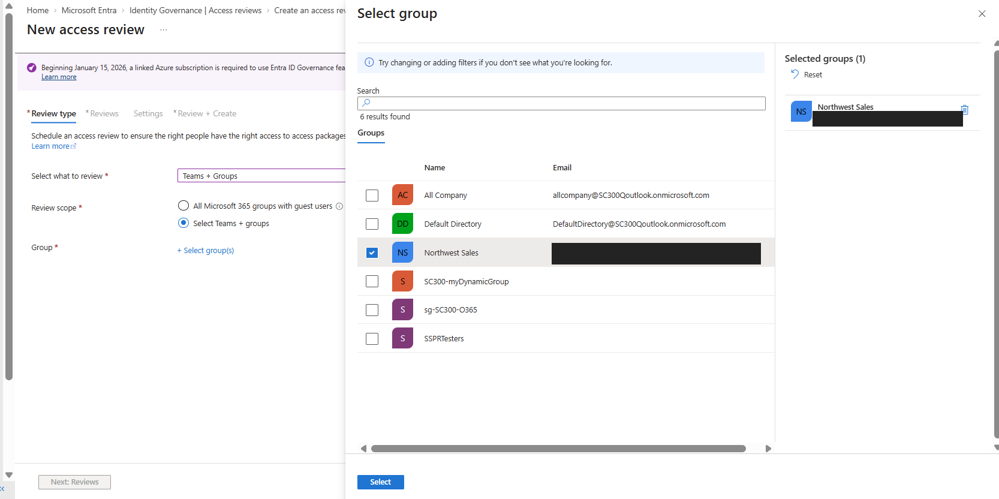
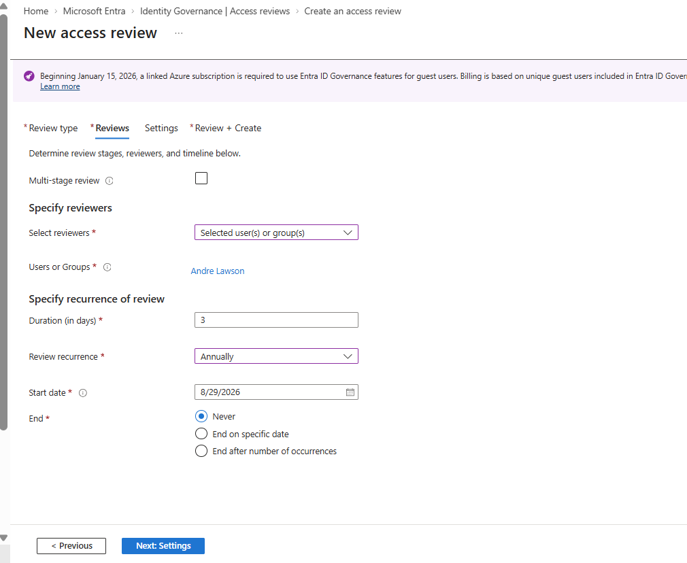
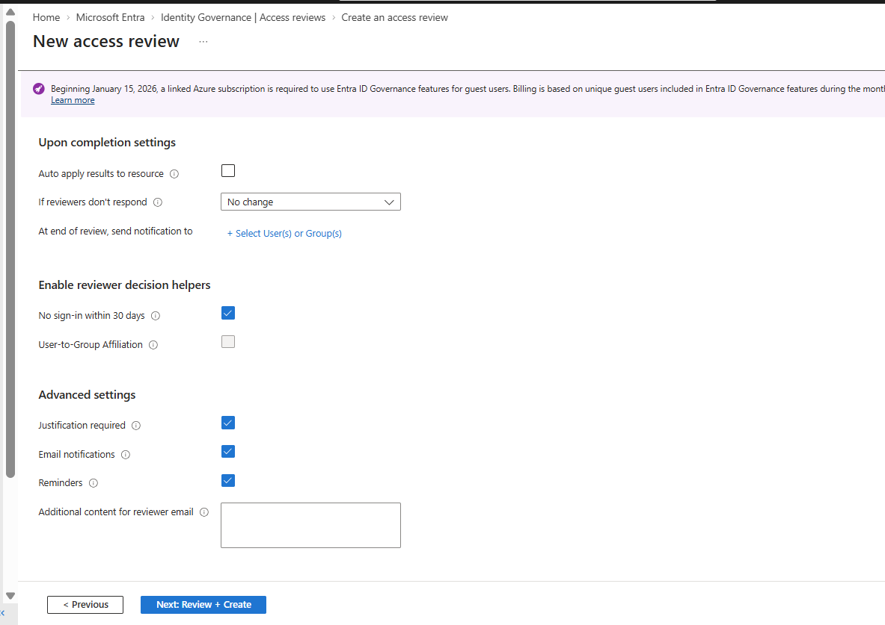
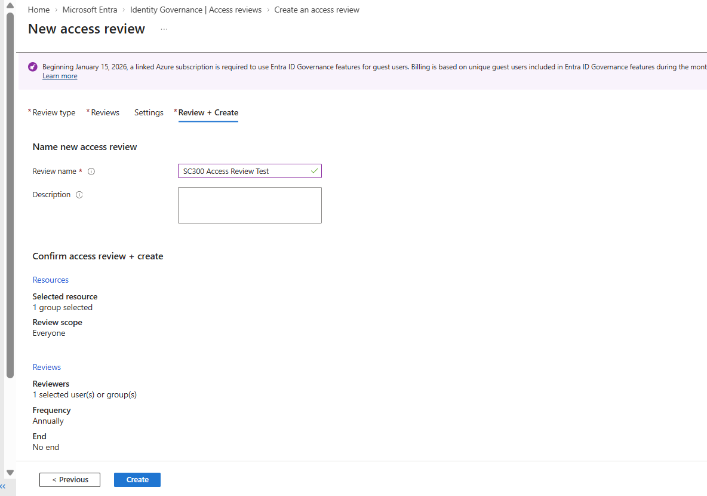
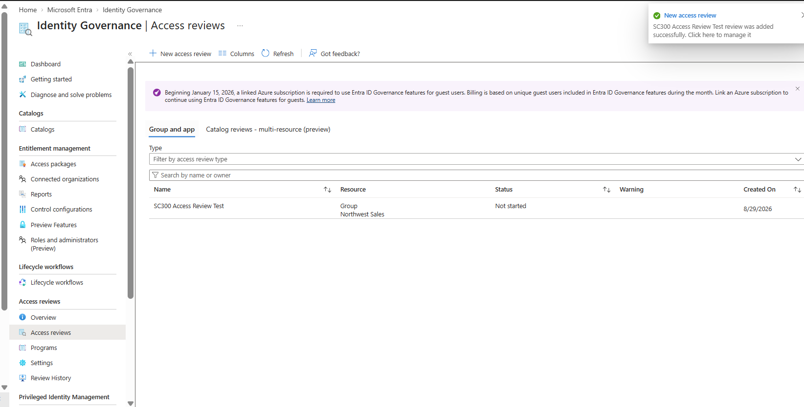

# Lab 25 – Creating Access Reviews

## Objective

Configure a Microsoft Entra ID Access Review to periodically review and govern user access to group resources. This lab demonstrates how access reviews can support identity governance by validating whether users should continue to retain access.

## What I Configured

- Created an Access Review for the **Northwest Sales** group
- Configured the review scope for group users
- Assigned **Andre Lawson** as the reviewer
- Configured the access review to run **annually**
- Set the review duration to **3 days**
- Reviewed access review completion and notification settings
- Enabled reviewer decision helpers and justification requirements
- Successfully created the **SC300 Access Review Test**

## Screenshots

### 1. Select Access Review Group

Selected **Northwest Sales** as the Microsoft 365 group whose membership and access would be evaluated through the Access Review.

### 2. Configure Reviewer and Schedule

Assigned **Andre Lawson** as the reviewer and configured the Access Review to run annually with a three-day review period.

### 3. Review Access Review Settings

Configured review behavior including reviewer decision assistance, justification requirements, email notifications, and reminders.

### 4. Review and Create

Reviewed the Access Review configuration before deployment to verify the selected resource, review scope, reviewer, and recurrence settings.

### 5. Access Review Created Successfully

Verified that **SC300 Access Review Test** was successfully created for the **Northwest Sales** group in Microsoft Entra ID Identity Governance.

## Skills Demonstrated

- Microsoft Entra ID Identity Governance
- Access Reviews
- Group Access Governance
- Reviewer Assignment
- Recurring Access Reviews
- Access Certification
- Identity Lifecycle Governance
- Least-Privilege Access Management
- IAM Governance Controls

## Key Takeaway

Access Reviews provide organizations with a structured way to periodically validate user access. By assigning reviewers, defining review schedules, and configuring decision settings, administrators can identify unnecessary access and help maintain least-privilege access across organizational resources.

---

**Status:** Lab Completed
