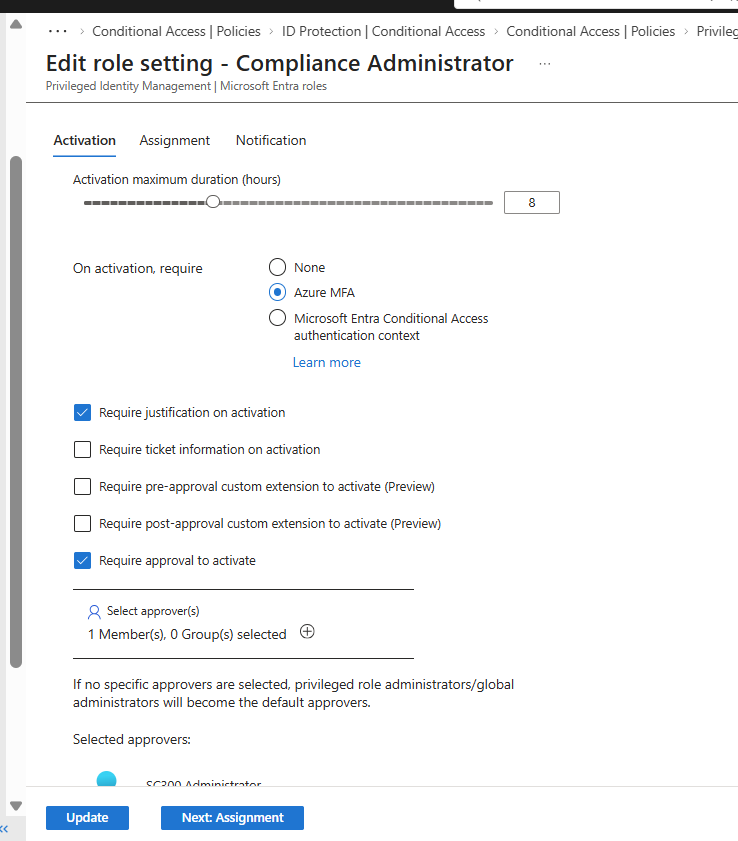
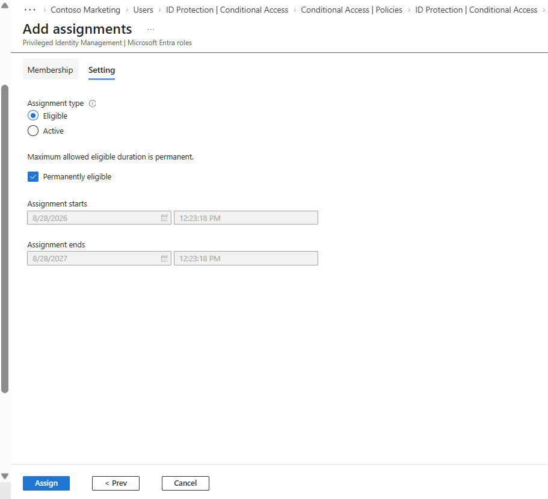
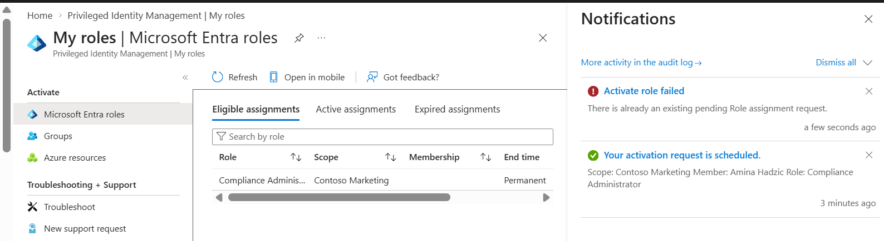
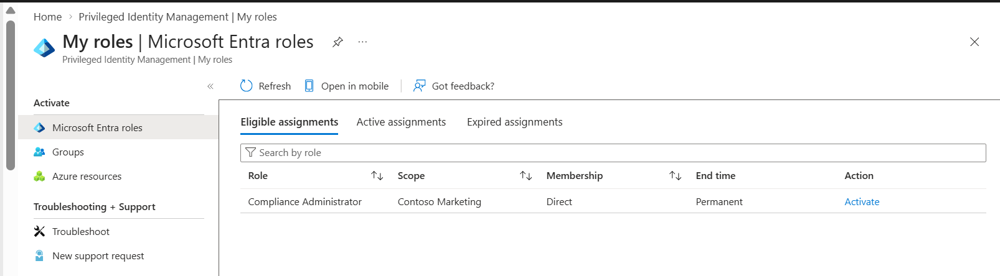
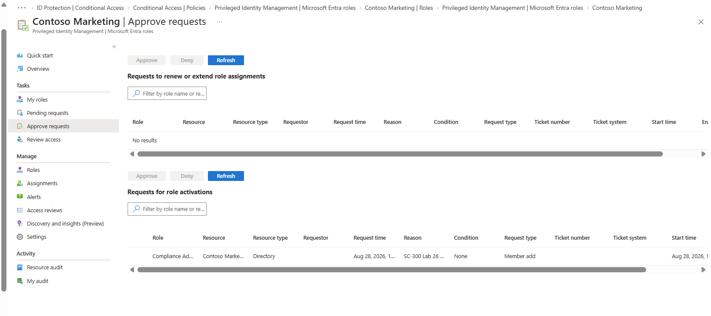
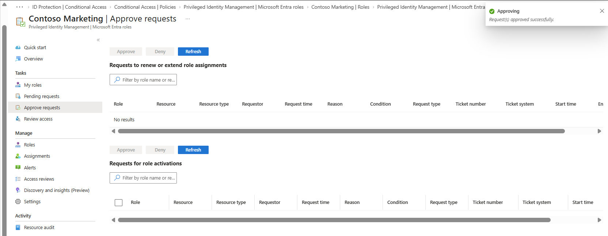
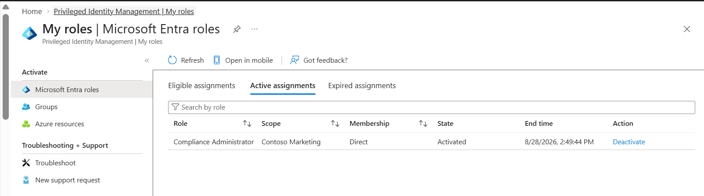
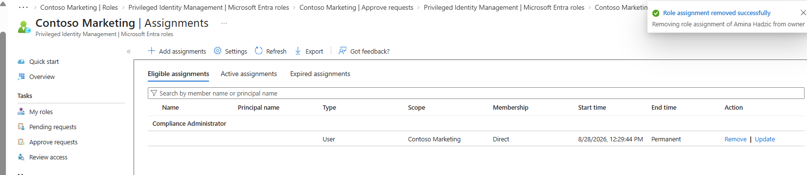

# Lab 26 – Privileged Identity Management (PIM)

## Objective
Configure Microsoft Entra Privileged Identity Management (PIM) to provide just-in-time privileged access while reducing standing administrative privileges.

This lab demonstrates the privileged access lifecycle from role configuration and eligible assignment through activation, approval, verification, and removal.

## What I Configured
- Configured activation requirements for the Compliance Administrator role
- Required Azure MFA and justification during role activation
- Configured approval before privileged access could be activated
- Assigned the Compliance Administrator role as an eligible PIM assignment
- Requested just-in-time activation of the privileged role
- Reviewed and approved the activation request
- Verified successful activation of the privileged role
- Removed the privileged role assignment after testing

## Key Skills
Microsoft Entra ID • Privileged Identity Management (PIM) • Just-in-Time Access • Role-Based Access Control (RBAC) • Least Privilege • Privileged Access Governance • MFA • Approval Workflows

## Screenshots

### 1. Configure PIM Activation Requirements
Configured the **Compliance Administrator** role activation settings. The role requires Azure MFA, justification, and approval before privileged access can be activated.

### 2. Create an Eligible Role Assignment
Assigned the **Compliance Administrator** role through PIM using an **Eligible** assignment instead of providing permanent active administrative access.

This supports least privilege by allowing privileged access only when it is required.

### 3. Submit the PIM Activation Request
Requested activation of the eligible Compliance Administrator role. The request entered the configured approval workflow rather than immediately granting privileged access.

### 4. Verify the Eligible Assignment
Verified that the Compliance Administrator role was successfully assigned as **Eligible** within Microsoft Entra PIM.

The administrator can request activation when privileged access is required without maintaining standing administrative privileges.

### 5. Review the Activation Request
Reviewed the pending privileged access request from the PIM approval interface before granting elevated permissions.

This demonstrates an additional governance control between requesting privileged access and receiving it.

### 6. Approve Privileged Access
Approved the Compliance Administrator activation request after reviewing the request through the PIM approval workflow.

### 7. Verify Just-in-Time Role Activation
Verified that the **Compliance Administrator** role successfully transitioned to an **Active** state after approval.

The privileged role is now available for the approved activation period rather than being permanently assigned.

### 8. Remove the Privileged Role Assignment
Removed the Compliance Administrator role assignment after completing testing.

This completed the privileged access lifecycle and ensured unnecessary privileged access was no longer assigned.

## Security Takeaways
This lab demonstrates how Microsoft Entra PIM can reduce the risks associated with standing administrative privileges by combining:

- Eligible role assignments
- Just-in-time activation
- MFA during activation
- Business justification
- Approval workflows
- Time-limited privileged access
- Role assignment cleanup

These controls support **least privilege and privileged access governance** by ensuring elevated permissions are granted only when needed and are subject to additional security controls.

## Status
**Lab Completed**
